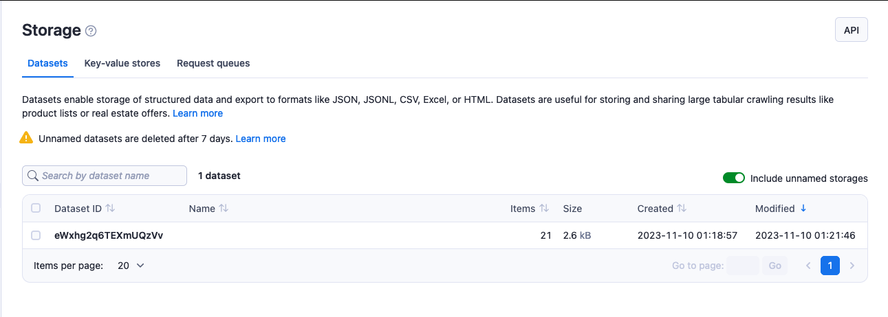
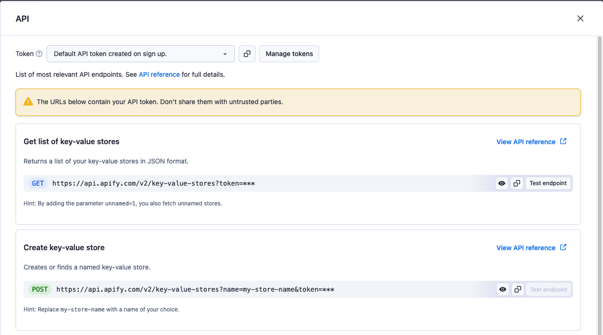
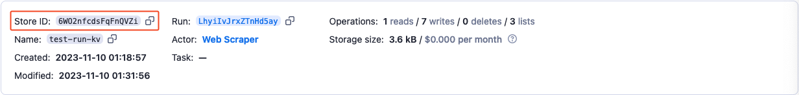

import Card from "@site/src/components/Card";
import CardGrid from "@site/src/components/CardGrid";
import StoragePricingCalculator from "@site/src/components/StoragePricingCalculator";

The Apify platform provides three types of storage accessible both within [Apify Console](https://console.apify.com/storage) and externally through the [REST API](/api/v2), [Apify API Clients](/api), and [SDKs](/sdk).

## Storage types

<CardGrid>
    <Card
        title="Dataset"
        desc="Stores results from web scraping and data processing, with each Actor run getting a unique dataset. Features include table-like data visualization and multiple export formats like JSON and Excel."
        to="/platform/storage/dataset"
    />
    <Card
        title="Key-value store"
        desc="Stores various data types like JSON, HTML, images, and strings. Accessible via Apify Console or API, it's ideal for diverse data storage needs.​"
        to="/platform/storage/key-value-store"
    />
    <Card
        title="Request queue"
        desc="Manages URL processing for web crawling and other tasks. Supports different crawling orders and allows for querying and updating URLs, accessible via Apify Console or API​."
        to="/platform/storage/request-queue"
    />
</CardGrid>

## Access your storage

You can access your storage in several ways:

* [Apify Console](https://console.apify.com/storage) - provides an easy-to-use interface.
* [Apify API](/api/v2/storage-key-value-stores) - to access your storages programmatically.
* [API clients](/api) - to access your storages from any Node.js/Python application.
* [Apify SDKs](/sdk) - when building your own JavaScript/Python Actor.

### Apify Console

To access your storages via Apify Console, navigate to the [**Storage**](https://console.apify.com/storage) section in the left-side menu. From there, you can click through the tabs to view your key-value stores, datasets, and request queues, and you can click on the **API** button in the top right corner to view related API endpoints. To view a storage, click its **ID**.



:::note Toggle unnamed storages

Use the **Include unnamed storages** checkbox to either display or hide unnamed storages. By default Apify Console displays them.

:::

You can edit your store's name by clicking on the **Actions** menu and selecting **Rename**.

Additionally, you can quickly share the contents and details of your storage by selecting **Share** under the **Actions** menu and providing either email, username or user ID.



<!-- vale Microsoft.Dashes = NO -->
These URLs link to API _endpoints_ - the places where your data is stored. Endpoints that allow you to _read_ stored information do not require an [authentication token](/api/v2#authentication). Calls are authenticated using a hard-to-guess ID, allowing for secure sharing. However, operations such as _update_ or _delete_ require the authentication token.
<!-- vale Microsoft.Dashes = YES -->

:::caution Token security

Never share a URL containing your authentication token — it would compromise your account's security. If the data you want to share requires a token, download it first and share it as a file.

:::

### Apify API

The [Apify API](/api/v2/storage-key-value-stores) allows you to access your storages programmatically using [HTTP requests](https://developer.mozilla.org/en-US/docs/Web/HTTP/Methods) and easily share your crawling results.

In most cases, when accessing your storages via API, you will need to provide a `store ID`, which you can do in the following formats:

* `WkzbQMuFYuamGv3YF` - the store's alphanumerical ID if the store is unnamed.
* `~store-name` - the store's name prefixed with tilde (`~`) character if the store is named (e.g. `~ecommerce-scraping-results`)
* `username~store-name` - username and the store's name separated by a tilde (`~`) character if the store is named and belongs to a different account (e.g. `janedoe~ecommerce-scraping-results`). Note that in this case, the store's owner needs to grant you access first.

For read (GET) requests, it is enough to use a store's alphanumerical ID, since the ID is hard to guess and effectively serves as an authentication key.

With other request types and when using the `username~store-name`, however, you will need to provide your secret API token in your request's [`Authorization`](/api/v2#authentication) header or as a query parameter. You can find your token on the [API & Integrations](https://console.apify.com/settings/integrations) page of your Apify account.

For further details and a breakdown of each storage API endpoint, refer to the [API documentation](/api/v2/storage-datasets).

### Apify API clients

The Apify API clients allow you to access your datasets from any Node.js or Python application, whether it's running on the Apify platform or externally.

You can visit [API clients](/api) documentations for more information.

### Apify SDKs

The Apify SDKs are libraries in JavaScript or Python that provide tools for building your own Actors.<br />

* JavaScript SDK requires [Node.js](https://nodejs.org/en/) 16 or later.
* Python SDK requires [Python](https://www.python.org/downloads/release/python-380/) 3.8 or above.

## Named and unnamed storages

The default storages for an Actor run are unnamed, identified only by an _ID_. Naming a storage ensures indefinite retention regardless of plan; unnamed storages follow the [data retention](#data-retention) rules below.

Named and unnamed storages are identical in all aspects except for their retention period. The key advantage of named storages is their ease in identifying and verifying the correct store. For example, storage names `janedoe~my-storage-1` and `janedoe~web-scrape-results` are easier to tell apart than the alphanumerical IDs `cAbcYOfuXemTPwnIB` and `CAbcsuZbp7JHzkw1B`. Storage names can be up to 63 characters long.

### Name a storage

You can name a storage via Apify Console or through the API.

In Apify Console:

1. Open your run's details and select the **Dataset**, **Key-value store**, or **Request queue** tab as appropriate.
1. Find the store's ID:

   

1. Click the ID to open the storage details.
1. Click on the **Actions** menu and choose **Rename**.
1. Enter a new name. Your storage is now preserved indefinitely.

Via API: get the storage's ID from the run that generated it using the [Get run](/api/v2/actor-run-get) endpoint, then rename it using the `Update [storage]` endpoint (for example, [Update dataset](/api/v2/dataset-put)).

The SDKs and clients each have their own naming conventions. See:

* [SDKs](/sdk)
* [API Clients](/api)

## Data retention

On the free plan, Apify stores the ten most recent runs for a maximum of 4 months. On paid plans, the retention period of the plan applies. Unnamed storages and runs beyond the latest ten are automatically deleted according to these retention periods. [Named storages](#named-and-unnamed-storages) are retained indefinitely.

:::info How retention periods are enforced

* Free plan: Your 10 most recent runs are retained for 4 months.
* Paid plans: All data (including your 10 most recent runs) follows your plan's retention period, which you can configure in your billing settings.
* Named storages: Always exempt from deletion regardless of retention periods.

Unnamed storages beyond the 10 most recent runs are deleted when the retention period expires.

:::

## Estimate your costs

Use this tool to estimate storage costs by plan and storage type.

<details>
  <summary>Estimate your storage costs</summary>

1. Select a storage type.
1. Choose a plan.
1. Enter storage, duration, and operation counts.
1. Review the estimated total and breakdown.

  <StoragePricingCalculator />
</details>

## Rate limiting

All API endpoints limit their rate of requests to protect Apify servers from overloading. The default rate limit for storage objects is _60 requests per second_. However, there are exceptions limited to _400 requests per second_ per storage object, including:

* [Push items](/api/v2/dataset-items-post) to dataset.
* CRUD ([add](/api/v2/request-queue-requests-post),
[get](/api/v2/request-queue-request-get),
[update](/api/v2/request-queue-request-put),
[delete](/api/v2/request-queue-request-delete))
operations of _request queue_ requests.

If a client exceeds this limit, the API endpoints respond with the HTTP status code `429 Too Many Requests` and the following body:

```json
{
    "error": {
        "type": "rate-limit-exceeded",
        "message": "You have exceeded the rate limit of ... requests per second"
    }
}
```

Go to the [API documentation](/api/v2#rate-limiting) for details and to learn what to do if you exceed the rate limit.

## Share

You can grant [access rights](../collaboration/index.md) to other Apify users to view or modify your storages. Check the [full list of permissions](../collaboration/list_of_permissions.md).

You can also share storages by link using their ID or name, depending on your account or resource-level general access setting. Learn how link-based access works in [General resource access](/platform/collaboration/general-resource-access).

For one-off sharing when access is restricted, generate time-limited pre-signed URLs. See [Sharing restricted resources with pre-signed URLs](/platform/collaboration/general-resource-access#pre-signed-urls).

:::tip Accessing restricted storage resources via API

If your storage resource is set to _restricted_, all API calls must include a valid authentication token in the `Authorization` header. If you're using **apify-client** the header is passed in automatically.

:::

## Concurrent access {#share-storages-between-runs}

Storage can be accessed from any [Actor](../actors/index.mdx) or [task](../actors/running/tasks.md) run, provided you have its _name_ or _ID_. You can access and manage storages from other runs using the same methods or endpoints as with storages from your current run.

[Datasets](./dataset.md) and [key-value stores](./key_value_store.md) support concurrent use by multiple Actors. Thus, several Actors or tasks can simultaneously write data to a single dataset or key-value store. Similarly, multiple runs can read data from datasets and key-value stores at the same time.

[Request queues](./request_queue.md), on the other hand, only allow multiple runs to add new data. A request queue can only be processed by one Actor or task run at any one time.

:::note Concurrent write order

When multiple runs write to a storage simultaneously, the order of writes is not guaranteed — data is written as each request is processed. The same applies in key-value stores and request queues: if a delete request precedes a read request for the same record, the read request fails.

:::

:::info Accessing restricted storage resources between runs

If a storage resource access is set to **Restricted**, the run from which it's accessed must have explicit access to it. Learn how restricted access works in [General resource access](/platform/collaboration/general-resource-access).

:::

## Delete storages

Named storages are only removed upon your request.<br/>
You can delete storages in the following ways:

* [Apify Console](https://console.apify.com/storage) - using the **Actions** button in the store's detail page.
* [JavaScript SDK](/sdk/js) - using the `.drop()` method of the
  [Dataset](/sdk/js/api/apify/class/Dataset#drop),
  [Key-value store](/sdk/js/api/apify/class/KeyValueStore#drop),
  or [Request queue](/sdk/js/api/apify/class/RequestQueue#drop) class.
* [Python SDK](/sdk/python) - using the `.drop()` method of the
  [Dataset](/sdk/python/reference/class/Dataset#drop),
  [Key-value store](/sdk/python/reference/class/KeyValueStore#drop),
  or [Request queue](/sdk/python/reference/class/RequestQueue#drop) class.
* [JavaScript API client](/api/client/js) - using the `.delete()` method in the
  [dataset](/api/client/js/reference/class/DatasetClient),
  [key-value store](/api/client/js/reference/class/KeyValueStoreClient),
  or [request queue](/api/client/js/reference/class/RequestQueueClient) clients.
* [Python API client](/api/client/python) - using the `.delete()` method in the
  [dataset](/api/client/python#datasetclient),
  [key-value store](/api/client/python/reference/class/KeyValueStoreClient),
  or [request queue](/api/client/python/reference/class/RequestQueueClient) clients.
* [API](/api/v2/key-value-store-delete) using the - `Delete [store]` endpoint, where `[store]` is the type of storage you want to delete.
