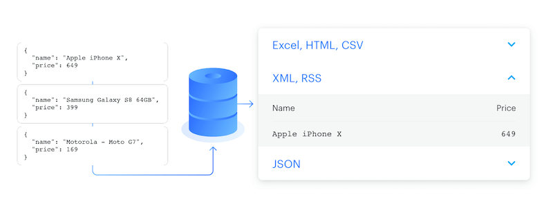

# Storage {#storage}

The Apify platform provides three types of storage. This guide will inform you which storage option is appropriate based on your use case.

1. [Dataset](#dataset) for storing a series of data objects. Good for storing web scraping results.
2. [Key-Value Store](#key-value-store) for storing binary data like images and for persisting Actor's state.
3. [Request Queue](#request-queue) for maintain a queue of URLs of web pages.

You can use these storages either with your [Actors](../actors/index.mdx) or you can access them via Apify platform [API](/api/v2#/).

## 1. Dataset {#dataset}

[Dataset](./dataset.md) storage allows you to store a series of data objects such as results from web scraping, crawling or data processing jobs. You can export your datasets in JSON, CSV, XML, RSS, Excel or HTML formats.

To get started with Dataset:

- Read [how to use Dataset](./dataset.md#basic-usage)
- Read about [sharing dataset across Actors](./dataset.md#sharing)
- Learn about [dataset Limits](./dataset.md#limits)
- Review [data retention period](./dataset.md#data-retention) for datasets.
- And finally, [how to delete a dataset](./dataset.md#delete-dataset).

## 2. Key-value store {#key-value-store}

The [key-value store](./key_value_store.md) is ideal for saving data records such as files, screenshots of web pages, and PDFs or for persisting your Actor's state. You can access these records under a unique name. Apify's key-value store is known for quick reading and writing tasks.

To get started with key-value store:

- Read [how to use key-value store](./key_value_store.md#basic-usage)
- Read about [sharing key-value store across Actors](./key_value_store.md#sharing)
- Learn about [key-value store Limits](./key_value_store.md#limits)
- Review [data retention period](./key_value_store.md#data-retention) for datasets.
- And finally, [how to delete a key-value store](./key_value_store.md#delete-kv-store).

## 3. Request queue {#request-queue}

The [Request queue](./request_queue.md) allows you to dynamically maintain a queue of URLs of web pages. You can use this when recursively crawling websites. you start from initial URLs and add new links as they are found while skipping duplicates.

To get started with Request queue:

- Read [how to use Request queue](./request_queue.md#basic-usage)
- Read about [sharing Request queue across Actors](./request_queue.md#sharing)
- Learn about [Request queue Limits](./request_queue.md#limits)
- Review [data retention period](./request_queue.md#data-retention) for datasets.
- And finally, [how to delete a Request queue](./request_queue.md#delete-request-queue).

## Named and unnanmed Storage {#named-and-unnamed-storages}

The default storages for an Actor run are created without a name (with only an **ID**). This allows them to expire after 7 days (on the free plan, longer on paid plans). This doesn't take up your storage space. If you want to persist the default storage, simply give it a name, and it will be retained indefinitely.

> Storages' names can be up to 63 characters long.

Named and unnamed storages are the same in all regards except their retention period. The only difference is that named storages make it easier to verify you are using the correct store.

For example, the storage names **janedoe~my-storage-1** and **janedoe~web-scrape-results** are easier to tell apart than the alphanumerical IDs **cAbcYOfuXemTPwnIB** and **CAbcsuZbp7JHzkw1B**.