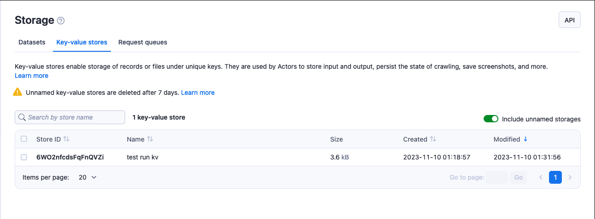
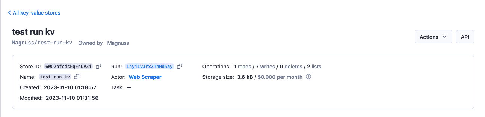

# Key-value store

**Store anything from Actor or task run results, JSON documents, or images. Learn how to access and manage key-value stores from Apify Console or via API.**

import Tabs from '@theme/Tabs';
import TabItem from '@theme/TabItem';

---

The key-value store is simple storage that can be used for storing any kind of data. It can be JSON or HTML documents, zip files, images, or strings. The data are stored along with their [MIME content type](https://developer.mozilla.org/en-US/docs/Web/HTTP/Basics_of_HTTP/MIME_types/Common_types).

Each Actor run is assigned its own key-value store when it is created. The store contains the Actor's input, and, if necessary, other data such as its output.

Key-value stores are mutable–you can both add entries and delete them.

> Named key-value stores are retained indefinitely. <br/>
> Unnamed key-value stores expire after 7 days unless otherwise specified.<br/>
> [Learn more](./index.md#named-and-unnamed-storages)

## Basic usage

There are several ways to access your key-value stores

* [Apify Console](https://console.apify.com/storage?tab=keyValueStores) - provides an easy-to-understand interface.
* [JavaScript SDK](/sdk/js/docs/guides/result-storage#key-value-store) - when building your own JavaScript Actor.
* [Python SDK](sdk/python/docs/concepts/storages#working-with-key-value-stores) - when building your own Python Actor.
* [JavaScript API client](/api/client/js/reference/class/KeyValueStoreClient) - to access your key-value stores from any Node.js application.
* [Python API client](/api/client/python/reference/class/KeyValueStoreClient) - to access your key-value stores from any Python application.
* [Apify API](/api/v2#/reference/key-value-stores/get-items) - for accessing your key-value stores programmatically.

### Apify Console

In [Apify Console](https://console.apify.com), you can view your key-value stores in the [Storage](https://console.apify.com/storage) section under the [Key-value stores](https://console.apify.com/storage?tab=keyValueStores) tab.



To view a key-value store's content, click on its **Store ID**.
Under the **Actions** menu, you can rename your store (and, in turn extend its [retention period](./usage#named-and-unnamed-storages)) and grant [access rights](../collaboration/index.md) using the **Share** button.
Click on the **API** button to view and test a store's [API endpoints](/api/v2#/reference/key-value-stores).



### JavaScript SDK

When working with a Javascript [Actor](../actors/index.mdx), the [JavaScript SDK](/sdk/js/docs/guides/result-storage#key-value-store) is an essential tool, especially for key-value store management. The primary class for this purpose is the [`KeyValueStore`](/sdk/js/reference/class/KeyValueStore). This class allows you to decide whether your data will be stored locally or in the Apify cloud. For data manipulation, it offers the [`getValue()`](/sdk/js/reference/class/KeyValueStore#getValue) and [`setValue()`](/sdk/js/reference/class/KeyValueStore#setValue) methods to retrieve and assign values, respectively.

Additionally, you can iterate over the keys in your store using the [`forEachKey()`](/sdk/js/reference/class/KeyValueStore#forEachKey) method.

Every Actor run is linked to a default key-value store that is automatically created for that specific run. If you're running your Actors and opt to store data locally, you can easily supply the [input](../actors/running/input_and_output.md) by placing an _INPUT.json_ file in the corresponding directory of the default key-value store. This method ensures that you Actor has all the necessary data readily available for its execution.

You can find _INPUT.json_ and other key-value store files in the location below.

```text
{APIFY_LOCAL_STORAGE_DIR}/key_value_stores/{STORE_ID}/{KEY}.{EXT}
```

The default key-value store's ID is _default_. The `{KEY}` is the record's _key_ and `{EXT}` corresponds to the record value's MIME content type.

To manage your key-value stores, you can use the following methods. See the `KeyValueStore` class's [API reference](/sdk/js/reference/class/KeyValueStore) for the full list.

```js
import { Actor } from 'apify';

await Actor.init();
// ...

// Get the default input
const input = await Actor.getInput();

// Open a named key-value store
const exampleStore = await Actor.openKeyValueStore('my-store');

// Read a record in the exampleStore storage
const value = await exampleStore.getValue('some-key');

// Write a record to exampleStore
await exampleStore.setValue('some-key', { foo: 'bar' });

// Delete a record from exampleStore
await exampleStore.setValue('some-key', null);

// ...
await Actor.exit();
```

> Note that JSON is automatically parsed to a JavaScript object, text data returned as a string and other data is returned as binary buffer.

```js
import { Actor } from 'apify';

await Actor.init();
// ...

// Get input of your Actor
const input = await Actor.getInput();
const value = await Actor.getValue('my-key');

// ...
await Actor.setValue(
    'OUTPUT',
    imageBuffer,
    { contentType: 'image/jpeg' },
);

// ...
await Actor.exit();
```

The `Actor.getInput()` method is not only a shortcut to `Actor.getValue('INPUT')`; it is also compatible with [`Actor.metamorph()`](../actors/development/programming_interface/metamorph.md). This is because a metamorphed Actor run's input is stored in the _INPUT-METAMORPH-1_ key instead of _INPUT_, which hosts the original input.

Check out the [JavaScript SDK documentation](/sdk/js/docs/guides/result-storage#key-value-store) and the `KeyValueStore` class's [API reference](/sdk/js/reference/class/KeyValueStore) for details on managing your key-value stores with the JavaScript SDK.

### Python SDK

For Python [Actor](../actors/index.mdx), the [Python SDK](/sdk/python/docs/concepts/storages#working-with-key-value-stores) is essential. The key-value store is represented by a [`KeyValueStore`](/sdk/python/reference/class/KeyValueStore) class. You can use this class to specify whether your data is stored locally or in the Apify cloud. For further data manipulation it offers [`get_value()`](/sdk/python/reference/class/KeyValueStore#get_value) and [`set_value()`](/sdk/python/reference/class/KeyValueStore#set_value) methods to retrieve and assign values, respectively.

Every Actor run is linked to a default key-value store that is automatically created for that specific run. If you're running your Actors and opt to store data locally, you can easily supply the [input](../actors/running/input_and_output.md) by placing an _INPUT.json_ file in the corresponding directory of the default key-value store. This method ensures that you Actor has all the necessary data readily available for its execution.

You can find _INPUT.json_ and other key-value store files in the location below.

```text
{APIFY_LOCAL_STORAGE_DIR}/key_value_stores/{STORE_ID}/{KEY}.{EXT}
```

The default key-value store's ID is _default_. The {KEY} is the record's _key_ and {EXT} corresponds to the record value's MIME content type.

To manage your key-value stores, you can use the following methods. See the `KeyValueStore` class [documentation](/sdk/python/reference/class/KeyValueStore) for the full list.

```python
from apify import Actor
from apify.storages import KeyValueStore

async def main():
    async with Actor:
        # Open a named key-value store
        example_store: KeyValueStore = await Actor.open_key_value_store(name='my-store')

        # Read a record in the example_store storage
        value = await example_store.get_value('some-key')

        # Write a record to example_store
        await example_store.set_value('some-key', {'foo': 'bar'})

        # Delete a record from example_store
        await example_store.set_value('some-key', None)
```

> Note that JSON is automatically parsed to a Python dictionary, text data returned as a string and other data is returned as binary buffer.

```python
from apify import Actor

async def main():
    async with Actor:
        value = await Actor.get_value('my-key')
        # ...
        image_buffer = ...  # Get image data
        await Actor.set_value(key='OUTPUT', value=image_buffer, content_type='image/jpeg')
```

The `Actor.get_input()` method is not only a shortcut to `Actor.get_value('INPUT')`; it is also compatible with [`Actor.metamorph()`](../actors/development/programming_interface/metamorph.md). This is because a metamorphed Actor run's input is stored in the _INPUT-METAMORPH-1_ key instead of _INPUT_, which hosts the original input.

Check out the [Python SDK documentation](/sdk/python/docs/guides/result-storage#key-value-store) and the `KeyValueStore` class's [API reference](/sdk/python/reference/class/KeyValueStore) for details on managing your key-value stores with the Python SDK.

### JavaScript API client

The Apify [JavaScript API client](/api/client/js/reference/class/KeyValueStoreClient) (`apify-client`) enables you to access your key-value stores from any Node.js application, whether hosted on the Apify platform or externally.

After importing and initiating the client, you can save each key-value store to a variable for easier access.

```js
const myKeyValStoreClient = apifyClient.keyValueStore('jane-doe/my-key-val-store');
```

You can then use that variable to [access the key-value store's items and manage it](/api/client/js/reference/class/KeyValueStoreClient).

Check out the [JavaScript API client documentation](/api/client/js/reference/class/KeyValueStoreClient) for [help with setup](/api/client/js/docs) and more details.

### Python API client

The Apify [Python API client](/api/client/python/reference/class/KeyValueStoreClient) (`apify-client`) allows you to access your key-value stores from any Python application, whether it is running on the Apify platform or externally.

After importing and initiating the client, you can save each key-value store to a variable for easier access.

```python
my_key_val_store_client = apify_client.key_value_store('jane-doe/my-key-val-store')
```

You can then use that variable to [access the key-value store's items and manage it](/api/client/python/reference/class/KeyValueStoreClient).

Check out the [Python API client documentation](/api/client/python/reference/class/KeyValueStoreClient) for [help with setup](/api/client/python/docs/quick-start) and more details.

### Apify API

The [Apify API](/api/v2#/reference/key-value-stores) enables you programmatic acces to your key-value stores using [HTTP requests](https://developer.mozilla.org/en-US/docs/Web/HTTP/Methods).

If you are accessing your datasets using the `username~store-name` [store ID format](./index.md), you will need to use your [secret API token](../integrations/index.mdx#api-token). You can find the token (and your user ID) on the [Integrations](https://console.apify.com/account#/integrations) tab of **Settings** page of your Apify account.

> When providing your API authentication token, we recommend using the request's `Authorization` header, rather than the URL. ([More info](../integrations/api.md#authentication)).

To retrieve a list of your key-value stores, send a GET request to the [Get list of key-value stores](/api/v2#/reference/key-value-stores/store-collection/get-list-of-key-value-stores) endpoint.

```text
https://api.apify.com/v2/key-value-stores
```

To get information about a key-value store such as its creation time and item count, send a GET request to the [Get store](/api/v2#/reference/key-value-stores/store-object/get-store) endpoint.

```text
https://api.apify.com/v2/key-value-stores/{STORE_ID}
```

To get a record (its value) from a key-value store, send a GET request to the [Get record](/api/v2#/reference/key-value-stores/key-collection/get-record) endpoint.

```text
https://api.apify.com/v2/key-value-stores/{STORE_ID}/records/{KEY_ID}
```

To add a record with a specific key in a key-value store, send a PUT request to the [Put record](/api/v2#/reference/key-value-stores/record/put-record) endpoint.

```text
https://api.apify.com/v2/key-value-stores/{STORE_ID}/records/{KEY_ID}
```

Example payload:

```json
{
    "foo": "bar",
    "fos": "baz"
}
```

To delete a record, send a DELETE request specifying the key from a key-value store to the [Delete record](/api/v2#/reference/key-value-stores/record/delete-record) endpoint.

```text
https://api.apify.com/v2/key-value-stores/{STORE_ID}/records/{KEY_ID}
```

For further details and a breakdown of each storage API endpoint, refer to the [API documentation](/api/v2#/reference/key-value-stores).

## Compression

Previously, when using the [Put record](/api/v2#/reference/key-value-stores/record/put-record) endpoint, every record was automatically compressed with Gzip before being uploaded. However, this process has been updated. _Now, record are stored exactly as you upload them._ This change means that it is up to you whether the record is stored compressed or uncompressed.

You can compress a record and use the [Content-Encoding request header](https://developer.mozilla.org/en-US/docs/Web/HTTP/Headers/Content-Encoding) to let our platform know which compression it uses. We recommend compressing large key-value records to save storage space and network traffic.

_Using the [JavaScript SDK](/sdk/js/reference/class/KeyValueStore#setValue) or our [JavaScript API client](/api/client/js/reference/class/KeyValueStoreClient#setRecord) automatically compresses your files._ We advise utilizing the JavaScript API client for data compression prior to server upload and decompression upon retrieval, minimizing storage costs.

## Sharing

You can grant [access rights](../collaboration/index.md) to your dataset through the **Share** button under the **Actions** menu. For more details check the [full list of permissions](../collaboration/list_of_permissions.md).

### Sharing key-value stores between runs

You can access a key-value store from any [Actor](../actors/index.mdx) or [task](../actors/running/tasks.md) run as long as you know its _name_ or _ID_.

To access a key-value store from another run using the [JavaScript SDK](/sdk/js) or the [Python SDK](/sdk/python), open it using the same method as you would do with any other store.

<Tabs groupId="main">
<TabItem value="JavaScript" label="JavaScript">

```js
import { Actor } from 'apify';

await Actor.init();

const otherStore = await Actor.openKeyValueStore('old-store');
// ...

await Actor.exit();
```

</TabItem>
<TabItem value="Python" label="Python">

```python
from apify import Actor

async def main():
    async with Actor:
        other_store = await Actor.open_key_value_store(name='old-store')
        # ...
```

</TabItem>
</Tabs>

In the [JavaScript API client](/api/client/js/reference/class/KeyValueStoreClient) as well as in [Python API client](/api/client/python/reference/class/KeyValueStoreClient), you can access a store using its client. Once you've opened a store, read and manage its contents like you would do with a key-value store from your current run.

<Tabs groupId="main">
<TabItem value="JavaScript" label="JavaScript">

```js
const otherStoreClient = apifyClient.keyValueStore('jane-doe/old-store');
```

</TabItem>
<TabItem value="Python" label="Python">

```python
other_store_client = apify_client.key_value_store('jane-doe/old-store')
```

</TabItem>
</Tabs>

The same applies for the [Apify API](#apify-api) - you can use [the same endpoints](#apify-api) as you would normally do.

Check out the [Storage overview](/platform/storage#sharing-storages-between-runs) for details on sharing storages between runs.

## Data consistency

Key-value storage uses the [AWS S3](https://aws.amazon.com/s3/) service. According to the [S3 documentation](https://aws.amazon.com/s3/consistency/), it provides _strong read-after-write_ consistency.

## Limits

* The maximum length for key-value store is 63 characters.
