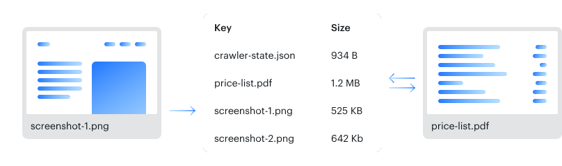
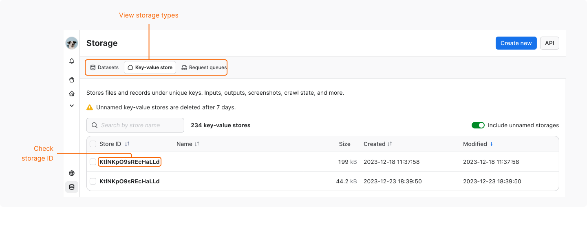
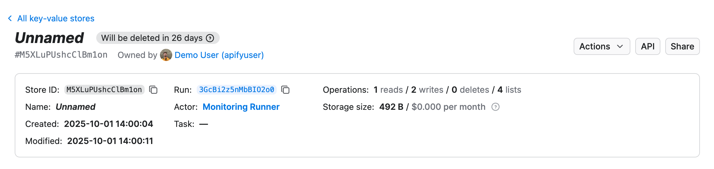
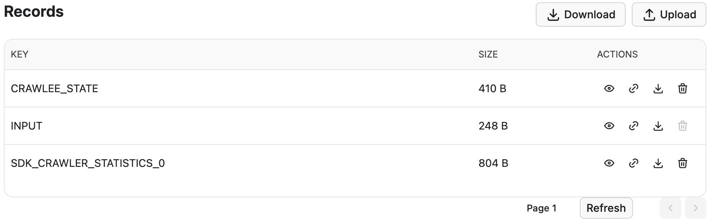

The key-value store is simple storage that can be used for storing any kind of data. It can be JSON or HTML documents, zip files, images, or strings. The data are stored along with their [MIME content type](https://developer.mozilla.org/en-US/docs/Web/HTTP/Basics_of_HTTP/MIME_types/Common_types).

Each Actor run is assigned its own key-value store when it is created. The store contains the Actor's input, and, if necessary, other data such as its output.

Key-value stores are mutable - you can both add entries and delete them.

:::info Retention period

Named key-value stores are retained indefinitely. Unnamed key-value stores expire after 7 days unless otherwise specified. [Learn more](/storage#data-retention)

:::



## Basic usage

You can access your key-value stores in several ways:

- [Apify Console](https://console.apify.com) - view and manage your key-value stores in a visual interface.
- [Apify API](/api/v2) - for accessing your key-value stores programmatically.
- [Apify API clients](/api) - to access your key-value stores from any Node.js/Python application.
- [Apify SDKs](/sdk) - when building your own JavaScript/Python Actor.

### Apify Console

In [Apify Console](https://console.apify.com), you can view your key-value stores in the [Storage](https://console.apify.com/storage) section under the [Key-value stores](https://console.apify.com/storage?tab=keyValueStores) tab.



To view a key-value store's content, click on its **Store ID**. Under the **Actions** menu, you can rename your store (which affects its [retention period](/storage#named-and-unnamed-storages)) and grant [access rights](/account/collaboration) using the **Share** button.
Click on the **API** button to view and test a store's [API endpoints](/api/v2/storage-key-value-stores).



At the bottom of the page, you can work with records in your key-value store:

- Upload one or more new records and set their keys.
- View individual records.
- Download individual records, or download all records at once.
- Copy shareable links to records.
- Delete records.



### Apify API

The [Apify API](/api/v2/storage-key-value-stores) gives you programmatic access to your key-value stores using [HTTP requests](https://developer.mozilla.org/en-US/docs/Web/HTTP/Methods).

If you are accessing your key-value stores using the `username~store-name` [store ID format](../index.md), you will need to use your secret API token. You can find the token (and your user ID) on the [API & Integrations](https://console.apify.com/settings/integrations) tab of **Settings** page of your Apify account.

:::tip Authentication

When providing your API authentication token, we recommend using the request's `Authorization` header, rather than the URL. For more information, refer to the [API integration](../../integrations/programming/api.md#authentication) documentation.

:::

To retrieve a list of your key-value stores, send a GET request to the [Get list of key-value stores](/api/v2/key-value-stores-get) endpoint.

```text
https://api.apify.com/v2/key-value-stores
```

To get information about a key-value store such as its creation time and item count, send a GET request to the [Get store](/api/v2/key-value-store-get) endpoint.

```text
https://api.apify.com/v2/key-value-stores/{STORE_ID}
```

To get a record (its value) from a key-value store, send a GET request to the [Get record](/api/v2/key-value-store-record-get) endpoint.

```text
https://api.apify.com/v2/key-value-stores/{STORE_ID}/records/{KEY_ID}
```

To add a record with a specific key in a key-value store, send a PUT request to the [Store record](/api/v2/key-value-store-record-put) endpoint.

```text
https://api.apify.com/v2/key-value-stores/{STORE_ID}/records/{KEY_ID}
```

Example payload:

```json
{
    "foo": "bar",
    "fos": "baz"
}
```

To delete a record, send a DELETE request specifying the key from a key-value store to the [Delete record](/api/v2/key-value-store-record-delete) endpoint.

```text
https://api.apify.com/v2/key-value-stores/{STORE_ID}/records/{KEY_ID}
```

For further details and a breakdown of each storage API endpoint, refer to the [API documentation](/api/v2/storage-key-value-stores).

### Apify API Clients

#### JavaScript API client

The Apify [JavaScript API client](/api/client/js/reference/class/KeyValueStoreClient) (`apify-client`) enables you to access your key-value stores from any Node.js application, whether hosted on the Apify platform or externally.

After importing and initializing the client, you can save each key-value store to a variable for easier access.

```js
const myKeyValStoreClient = apifyClient.keyValueStore(
    'jane-doe/my-key-val-store',
);
```

You can then use that variable to [access the key-value store's items and manage it](/api/client/js/reference/class/KeyValueStoreClient).

Check out the [JavaScript API client documentation](/api/client/js/reference/class/KeyValueStoreClient) for [help with setup](/api/client/js/docs) and more details.

#### Python API client

The Apify [Python API client](/api/client/python/reference/class/KeyValueStoreClient) (`apify-client`) allows you to access your key-value stores from any Python application, whether it is running on the Apify platform or externally.

After importing and initializing the client, you can save each key-value store to a variable for easier access.

```python
my_key_val_store_client = apify_client.key_value_store('jane-doe/my-key-val-store')
```

You can then use that variable to [access the key-value store's items and manage it](/api/client/python/reference/class/KeyValueStoreClient).

Check out the [Python API client documentation](/api/client/python/reference/class/KeyValueStoreClient) for [help with setup](/api/client/python/docs/overview/introduction) and more details.

### Apify SDKs

#### JavaScript SDK

In JavaScript [Actors](../../actors/index.mdx), manage key-value stores with the JavaScript SDK's [`KeyValueStore`](/sdk/js/reference/class/KeyValueStore) class. It works both locally and on the Apify platform. To read and write records, use the [`getValue()`](/sdk/js/reference/class/KeyValueStore#getValue) and [`setValue()`](/sdk/js/reference/class/KeyValueStore#setValue) methods; to iterate over keys, use [`forEachKey()`](/sdk/js/reference/class/KeyValueStore#forEachKey).

Every Actor run is linked to a default key-value store, created automatically for that run. When you run your Actor locally, you can supply its [input](../../actors/running/input_and_output.md) by placing an _INPUT.json_ file in the default key-value store's directory.

You can find _INPUT.json_ and other key-value store files in the location below.

```text
{APIFY_LOCAL_STORAGE_DIR}/key_value_stores/{STORE_ID}/{KEY}.{EXT}
```

The default key-value store's ID is _default_. The `{KEY}` is the record's _key_ and `{EXT}` corresponds to the record value's MIME content type.

To manage your key-value stores, you can use the following methods. See the `KeyValueStore` class's [API reference](/sdk/js/reference/class/KeyValueStore) for the full list.

```js
import { Actor } from 'apify';

await Actor.init();
// ...

// Get the default input
const input = await Actor.getInput();

// Open a named key-value store
const exampleStore = await Actor.openKeyValueStore('my-store');

// Read a record in the exampleStore storage
const value = await exampleStore.getValue('some-key');

// Write a record to exampleStore
await exampleStore.setValue('some-key', { foo: 'bar' });

// Delete a record from exampleStore
await exampleStore.setValue('some-key', null);

// ...
await Actor.exit();
```

:::note Automatic parsing

JSON is automatically parsed to a JavaScript object, text data is returned as a string, and other data is returned as a binary buffer.

:::

```js
import { Actor } from 'apify';

await Actor.init();
// ...

// Get input of your Actor
const input = await Actor.getInput();
const value = await Actor.getValue('my-key');

// ...
await Actor.setValue('OUTPUT', imageBuffer, { contentType: 'image/jpeg' });

// ...
await Actor.exit();
```

The `Actor.getInput()` method is not only a shortcut to `Actor.getValue('INPUT')`; it is also compatible with [`Actor.metamorph()`](../../actors/development/programming_interface/metamorph.md). This is because a metamorphed Actor run's input is stored in the _INPUT-METAMORPH-1_ key instead of _INPUT_, which hosts the original input.

Check out the [JavaScript SDK documentation](/sdk/js/docs/guides/result-storage#key-value-store) and the `KeyValueStore` class's [API reference](/sdk/js/reference/class/KeyValueStore) for details on managing your key-value stores with the JavaScript SDK.

#### Python SDK

In Python [Actors](../../actors/index.mdx), manage key-value stores with the Python SDK's [`KeyValueStore`](/sdk/python/reference/class/KeyValueStore) class. It works both locally and on the Apify platform. To read and write records, use the [`get_value()`](/sdk/python/reference/class/KeyValueStore#get_value) and [`set_value()`](/sdk/python/reference/class/KeyValueStore#set_value) methods.

Every Actor run is linked to a default key-value store, created automatically for that run. When you run your Actor locally, you can supply its [input](../../actors/running/input_and_output.md) by placing an _INPUT.json_ file in the default key-value store's directory.

You can find _INPUT.json_ and other key-value store files in the location below.

```text
{APIFY_LOCAL_STORAGE_DIR}/key_value_stores/{STORE_ID}/{KEY}.{EXT}
```

The default key-value store's ID is _default_. The `{KEY}` is the record's _key_ and `{EXT}` corresponds to the record value's MIME content type.

To manage your key-value stores, you can use the following methods. See the `KeyValueStore` class [documentation](/sdk/python/reference/class/KeyValueStore) for the full list.

```python
from apify import Actor
from apify.storages import KeyValueStore

async def main():
    async with Actor:
        # Open a named key-value store
        example_store: KeyValueStore = await Actor.open_key_value_store(name='my-store')

        # Read a record in the example_store storage
        value = await example_store.get_value('some-key')

        # Write a record to example_store
        await example_store.set_value('some-key', {'foo': 'bar'})

        # Delete a record from example_store
        await example_store.set_value('some-key', None)
```

:::note Automatic parsing

JSON is automatically parsed to a Python dictionary, text data is returned as a string, and other data is returned as a binary buffer.

:::

```python
from apify import Actor

async def main():
    async with Actor:
        value = await Actor.get_value('my-key')
        # ...
        image_buffer = ...  # Get image data
        await Actor.set_value(key='OUTPUT', value=image_buffer, content_type='image/jpeg')
```

The `Actor.get_input()` method is not only a shortcut to `Actor.get_value('INPUT')`; it is also compatible with [`Actor.metamorph()`](../../actors/development/programming_interface/metamorph.md). This is because a metamorphed Actor run's input is stored in the _INPUT-METAMORPH-1_ key instead of _INPUT_, which hosts the original input.

Check out the [Python SDK documentation](/sdk/python/docs/concepts/storages#working-with-key-value-stores) and the `KeyValueStore` class's [API reference](/sdk/python/reference/class/KeyValueStore) for details on managing your key-value stores with the Python SDK.

## Compression

Records are stored exactly as you upload them, compressed or uncompressed.

You can compress a record and use the [Content-Encoding request header](https://developer.mozilla.org/en-US/docs/Web/HTTP/Headers/Content-Encoding) to let the platform know which compression it uses. We recommend compressing large key-value records to save storage space and network traffic.

The [JavaScript SDK](/sdk/js/reference/class/KeyValueStore#setValue) and the [JavaScript API client](/api/client/js/reference/class/KeyValueStoreClient#setRecord) compress and decompress records automatically.

## Share and reuse {#share}

You can grant access rights to your key-value store, share it by link, or generate a time-limited pre-signed URL for specific records. See [Share storage](../share.md).

To read from or write to a key-value store that belongs to a different Actor or task run, see [Use storage from another run](../use-from-another-run.md).

## Data consistency

Key-value storage uses the [AWS S3](https://aws.amazon.com/s3/) service. According to the [S3 documentation](https://aws.amazon.com/s3/consistency/), it provides strong read-after-write consistency.

## Limits

- The maximum length for a key in a key-value store is 256 characters. Keys may only contain the following characters: `a-zA-Z0-9!-_.'()`.

- The maximum length for a key-value store name is 63 characters.

### Rate limiting

Operations on a single record ([get](/api/v2/key-value-store-record-get), [put](/api/v2/key-value-store-record-put), [delete](/api/v2/key-value-store-record-delete)) and [getting the list of keys](/api/v2/key-value-store-keys-get) are limited to _200 requests per second_ per store.

[Downloading all records](/api/v2/key-value-store-records-get) as a ZIP archive is limited to _100 requests per second_ per store.

All other key-value store [API endpoints](/api/v2/storage-key-value-stores) use the default limit of _60 requests per second_ per store.

Check out the [API documentation](/api/v2#rate-limiting) for more information and guidance on actions to take if you exceed these rate limits.
