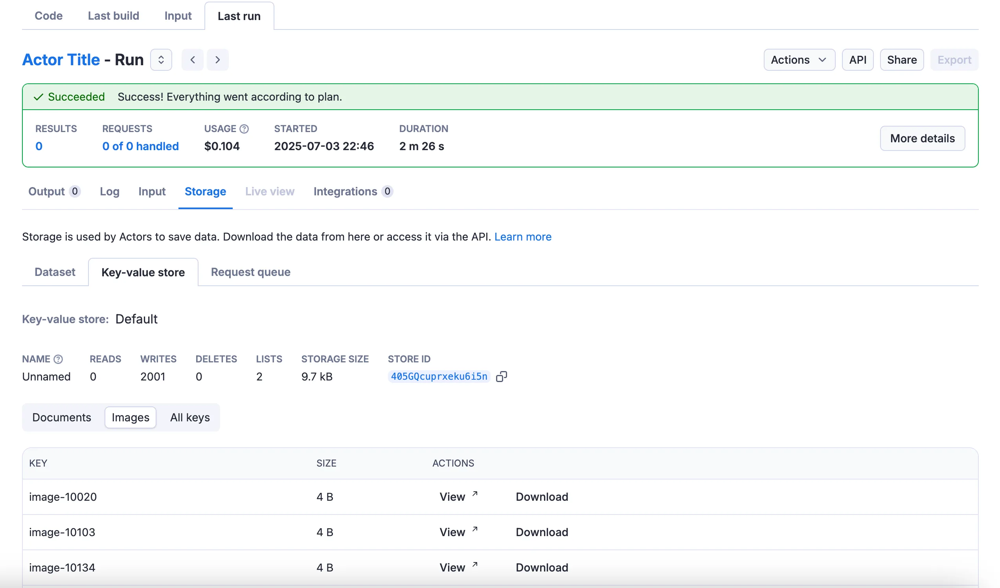
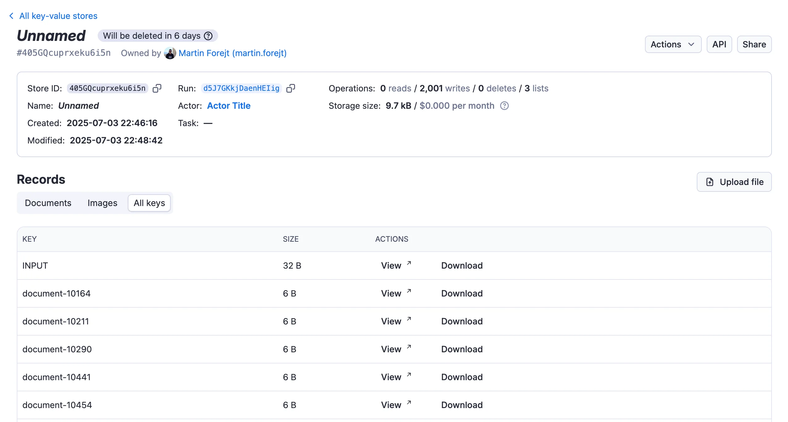

The key‑value store schema organizes keys into logical groups called collections, which can be used to filter and categorize data both in the API and the visual user interface. This organization helps users navigate and find specific data more efficiently, while schema‑defined rules (such as content types and JSON schema) ensure that stored values remain consistent and valid.

## Schema components

A key-value store schema has one component:

- `collections` _(required)_ - Named groups of keys, each defined by a shared key prefix or a single key. A collection can also validate the content type of its records and, for JSON, validate them against a JSON Schema.

```json title=".actor/key_value_store_schema.json"
{
    "actorKeyValueStoreSchemaVersion": 1,
    "title": "Key-value store schema",
    "collections": {
        "documents": {
            "title": "Documents",
            "keyPrefix": "document-"
        }
    }
}
```

## File structure

Place the key-value store schema in the `.actor` folder in your Actor's root directory. You can organize it in two ways:

### Inline in `actor.json`

```json title=".actor/actor.json"
{
    "actorSpecification": 1,
    "name": "this-is-book-library-scraper",
    "title": "Book Library scraper",
    "version": "1.0.0",
    "storages": {
        "keyValueStore": {
            "actorKeyValueStoreSchemaVersion": 1,
            "title": "Key-Value Store Schema",
            "collections": { /* Define your collections here */ }
        }
    }
}
```

### Separate file

```json title=".actor/actor.json"
{
    "actorSpecification": 1,
    "name": "this-is-book-library-scraper",
    "title": "Book Library scraper",
    "version": "1.0.0",
    "storages": {
        "keyValueStore": "./key_value_store_schema.json"
    }
}
```

```json title=".actor/key_value_store_schema.json"
{
    "actorKeyValueStoreSchemaVersion": 1,
    "title": "Key-Value Store Schema",
    "collections": { /* Define your collections here */ }
}
```

Use a separate file when your schema is complex or you want to keep `actor.json` concise.

## Collections

Collections group related keys so they are easier to find and filter in Apify Console and through the API. Define each collection by a shared key prefix or a single key, and optionally validate the records it holds.

### Define collection membership

Each collection defines its member keys using one of the following properties:

- `keyPrefix` - Includes all keys that start with the specified prefix (for example, all keys starting with `document-`).
- `key` - Includes a single specific key.

Use either `key` or `keyPrefix` for each collection, but not both.

### Validate record content

When you define a collection with specific `contentTypes`, the Apify platform validates any data stored in that collection against those specifications. For example, if you specify that a collection should only contain JSON data with content type `application/json`, attempts to store data with other content types in that collection are rejected.

The validation happens automatically when you call `Actor.setValue()` or use the [Put record](https://docs.apify.com/api/v2/key-value-store-record-put) API endpoint.

If you define a `jsonSchema` for a collection with content type `application/json`, the platform also validates that the JSON data conforms to the specified schema. This helps ensure data consistency and prevents storing malformed data.

### Collection example

Consider an Actor that calls `Actor.setValue()` to save records into the key-value store:

```javascript title="main.js"
import { Actor } from 'apify';
// Initialize the JavaScript SDK
await Actor.init();

/**
 * Actor code
 */
await Actor.setValue('document-1', 'my text data', { contentType: 'text/plain' });

// ...

await Actor.setValue(`image-${imageID}`, imageBuffer, { contentType: 'image/jpeg' });

// Exit successfully
await Actor.exit();
```

To organize those records, define collections in the `.actor/actor.json` configuration:

```json title=".actor/actor.json"
{
    "actorSpecification": 1,
    "name": "Actor Name",
    "title": "Actor Title",
    "version": "1.0.0",
    "storages": {
        "keyValueStore": {
            "actorKeyValueStoreSchemaVersion": 1,
            "title": "Key-Value Store Schema",
            "collections": {
                "documents": {
                    "title": "Documents",
                    "description": "Text documents stored by the Actor.",
                    "keyPrefix": "document-"
                },
                "images": {
                    "title": "Images",
                    "description": "Images stored by the Actor.",
                    "keyPrefix": "image-",
                    "contentTypes": ["image/jpeg"]
                }
            }
        }
    }
}
```

This defines two collections for the default key-value store: `documents` for text keys prefixed `document-`, and `images` for JPEG keys prefixed `image-`.

Once the schema is defined, tabs for each collection appear in the **Storage** tab of the Actor's run:



The tabs also appear in the storage detail view:



### List keys by collection via the API

With the schema defined, use the API to list keys from a specific collection with the `collection` query parameter on the [Get list of keys](https://docs.apify.com/api/v2/key-value-store-keys-get) endpoint:

```http title="Get list of keys from a collection"
GET https://api.apify.com/v2/key-value-stores/{storeId}/keys?collection=documents
```

Example response:

```json
{
  "data": {
    "items": [
      {
        "key": "document-1",
        "size": 254
      },
      {
        "key": "document-2",
        "size": 368
      }
    ],
    "count": 2,
    "limit": 1000,
    "exclusiveStartKey": null,
    "isTruncated": false
  }
}
```

You can also filter by key prefix using the `prefix` parameter:

```http title="Get list of keys with prefix"
GET https://api.apify.com/v2/key-value-stores/{storeId}/keys?prefix=document-
```

## Reference

The key-value store schema defines the collections of keys and their properties. It allows you to organize and validate data stored by the Actor, making it easier to manage and retrieve specific records.

### `KeyValueStoreSchema` object

| Property                          | Type    | Required | Description                                                                                                     |
| --------------------------------- | ------- | -------- | --------------------------------------------------------------------------------------------------------------- |
| `actorKeyValueStoreSchemaVersion` | integer | true     | Specifies the version of key-value store schema structure document. <br/>Currently only version 1 is available. |
| `title`                           | string  | true     | Title of the schema                                                                                             |
| `description`                     | string  | false    | Description of the schema                                                                                       |
| `collections`                     | Object  | true     | An object where each key is a collection ID and its value is a collection definition object (see below).        |

### `Collection` object

| Property       | Type         | Required     | Description                                                                                                                                      |
| -------------- | ------------ | ------------ | ------------------------------------------------------------------------------------------------------------------------------------------------ |
| `title`        | string       | true         | The collection’s title, shown in the run's storage tab and in the storage detail view, where it appears as a tab for filtering records.          |
| `description`  | string       | false        | A description of the collection that appears in UI tooltips.                                                                                     |
| `key`          | string       | conditional* | Defines a single specific key that will be part of this collection.                                                                              |
| `keyPrefix`    | string       | conditional* | Defines a prefix for keys that should be included in this collection.                                                                            |
| `contentTypes` | string array | false        | Allowed content types for records in this collection. Used for validation when storing data.                                                     |
| `jsonSchema`   | object       | false        | For collections with content type `application/json`, you can define a JSON schema to validate structure. <br/>Uses JSON Schema Draft 07 format. |

\* Either `key` or `keyPrefix` must be specified for each collection, but not both.
