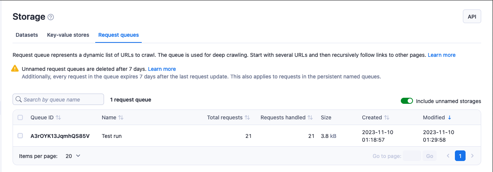
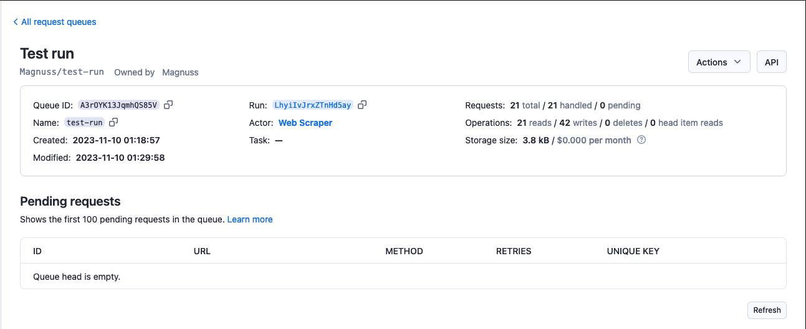

# Request queue {#request-queue}

**Queue URLs for an Actor to visit in its run. Learn how to share your queues between Actor runs. Access and manage request queues from Apify Console or via API.**

import Tabs from '@theme/Tabs';
import TabItem from '@theme/TabItem';

---

Request queues enable you to enqueue and retrieve requests such as URLs with an [HTTP method](https://developer.mozilla.org/en-US/docs/Web/HTTP/Methods) and other parameters. They are useful not only in web crawling, but anywhere you need to process a high number of URLs and enqueue new links.

Request queue storage supports both breadth-first and depth-first crawling orders, as well as custom data attributes. It allows you to query whether specific URLs were already found, push new URLs to the queue and fetch the next URLs to process.

> Named request queues are retained indefinitely. <br/>
> Unnamed request queues expire after 7 days unless otherwise specified.<br/>
> [Learn more](./index.md#named-and-unnamed-storages)

## Basic usage {#basic-usage}

There are five ways to access your request queues:

* [Apify Console](https://console.apify.com/storage?tab=requestQueues) - provides an easy-to-understand interface.
* [JavaScript SDK](/sdk/js/docs/guides/result-storage#request-queue) - when building your own JavaScript Actor.
* [Python SDK](/sdk/python/docs/concepts/storages#working-with-request-queues) - when building your own Python Actor.
* [JavaScript API client](/api/client/js/reference/class/RequestQueueClient) - to access your request queues from any Node.js application.
* [Python API client](/api/client/python/reference/class/RequestQueueClient) - to access your request queues from any Python application.
* [Apify API](/api/v2#/reference/request-queues) - for accessing your request queues programmatically.

### Apify Console {#apify-console}

In [Apify Console](https://console.apify.com), you can view your request queues in the [Storage](https://console.apify.com/storage) section under the [Request queues](https://console.apify.com/storage?tab=requestQueues) tab.

Only named request queues are displayed by default. Select the **Include unnamed request queues** checkbox to display all of your queues.



To view a request queue, click on its **Queue ID**.
Under the **Settings** tab, you can update the queue's name (and, in turn, its
[retention period](./index.md)) and [access rights](../collaboration/index.md).
Click on the `API` button to view and test a queue's [API endpoints](/api/v2#/reference/request-queues).



### JavaScript SDK {#javascript-sdk}

If you are building a JavaScript [Actor](../actors/index.mdx), you will be using the [JavaScript SDK](/sdk/js/docs/guides/request-storage#request-queue). The request queue is represented by a [`RequestQueue`](/sdk/js/reference/class/RequestQueue) class. You can use the class to specify whether your data is stored locally or in the Apify cloud and [enqueue new URLs](/sdk/js/reference/class/RequestQueue#addRequests).

Each Actor run is associated with the default request queue, which is created for the Actor run when the first request is added to it. Typically, it is used to store URLs to crawl in the specific Actor run, however its usage is optional. You can also create **named queues** which can be shared between Actors or between Actor runs.

If you are storing your data locally, you can find your request queue at the following location.

```text
{APIFY_LOCAL_STORAGE_DIR}/request_queues/{QUEUE_ID}/{ID}.json
```

The default request queue's ID is **default**. Each request in the queue is stored as a separate JSON file, where {ID} is a request ID.

To **open a request queue**, use the [`Actor.openRequestQueue()`](/sdk/js/reference/class/Actor#openRequestQueue) method.

```js
// Import the JavaScript SDK into your project
import { Actor } from 'apify';

await Actor.init();
// ...

// Open the default request queue associated with
// the Actor run
const queue = await Actor.openRequestQueue();

// Open the 'my-queue' request queue
const queueWithName = await Actor.openRequestQueue('my-queue');

// ...
await Actor.exit();
```

Once a queue is open, you can manage it using the following methods. See the `RequestQueue` class's [API reference](/sdk/js/reference/class/RequestQueue) for the full list.

```js
// Import the JavaScript SDK into your project
import { Actor } from 'apify';

await Actor.init();
// ...

const queue = await Actor.openRequestQueue();

// Enqueue requests
await queue.addRequests([{ url: 'http://example.com/aaa' }]);
await queue.addRequests([
    'http://example.com/foo',
    'http://example.com/bar',
], { forefront: true });

// Get the next request from queue
const request1 = await queue.fetchNextRequest();
const request2 = await queue.fetchNextRequest();

// Get a specific request
const specificRequest = await queue.getRequest('shi6Nh3bfs3');

// Reclaim a failed request back to the queue
// and crawl it again
await queue.reclaimRequest(request2);

// Remove a queue
await queue.drop();

// ...
await Actor.exit();
```

See the [JavaScript SDK documentation](/sdk/js/docs/guides/request-storage#request-queue) and the `RequestQueue` class's [API reference](/sdk/js/reference/class/RequestQueue) for details on managing your request queues with the JavaScript SDK.

### Python SDK {#python-sdk}

If you are building a Python [Actor](../actors/index.mdx), you will be using the [Python SDK](/sdk/python/docs/concepts/storages#working-with-request-queues). The request queue is represented by a [`RequestQueue`](/sdk/python/reference/class/RequestQueue) class. You can use the class to specify whether your data is stored locally or in the Apify cloud and [enqueue new URLs](/sdk/python/reference/class/RequestQueue#add_requests).

Each Actor run is associated with the default request queue, which is created for the Actor run when the first request is added to it. Typically, it is used to store URLs to crawl in the specific Actor run, however its usage is optional. You can also create **named queues** which can be shared between Actors or between Actor runs.

If you are storing your data locally, you can find your request queue at the following location.

```text
{APIFY_LOCAL_STORAGE_DIR}/request_queues/{QUEUE_ID}/{ID}.json
```

The default request queue's ID is **default**. Each request in the queue is stored as a separate JSON file, where {ID} is a request ID.

To **open a request queue**, use the [`Actor.open_request_queue()`](/sdk/python/reference/class/Actor#open_request_queue) method.

```python
from apify import Actor

async def main():
    async with Actor:
        # Open the default request queue associated with the Actor run
        queue = await Actor.open_request_queue()

        # Open the 'my-queue' request queue
        queue_with_name = await Actor.open_request_queue(name='my-queue')

        # ...
```

Once a queue is open, you can manage it using the following methods. See the `RequestQueue` class's [API reference](/sdk/python/reference/class/RequestQueue) for the full list.

```python
from apify import Actor
from apify.storages import RequestQueue

async def main():
    async with Actor:
        queue: RequestQueue = await Actor.open_request_queue()

        # Enqueue requests
        await queue.add_request(request={'url': 'http:#example.com/aaa'})
        await queue.add_request(request={'url': 'http:#example.com/foo'})
        await queue.add_request(request={'url': 'http:#example.com/bar'}, forefront=True)

        # Get the next requests from queue
        request1 = await queue.fetch_next_request()
        request2 = await queue.fetch_next_request()

        # Get a specific request
        specific_request = await queue.get_request('shi6Nh3bfs3')

        # Reclaim a failed request back to the queue and crawl it again
        await queue.reclaim_request(request2)

        # Remove a queue
        await queue.drop()
```

See the [Python SDK documentation](/sdk/python/docs/guides/request-storage#request-queue) and the `RequestQueue` class's [API reference](/sdk/python/reference/class/RequestQueue) for details on managing your request queues with the Python SDK.

### JavaScript API client {#javascript-api-client}

Apify's [JavaScript API client](/api/client/js/reference/class/RequestQueueClient) (`apify-client`) allows you to access your request queues from any Node.js application, whether it is running on the Apify platform or elsewhere.

After importing and initiating the client, you can save each request queue to a variable for easier access.

```js
const myQueueClient = apifyClient.requestQueue('jane-doe/my-request-queue');
```

You can then use that variable to [access the request queue's items and manage it](/api/client/js/reference/class/RequestQueueClient).

See the [JavaScript API client documentation](/api/client/js/reference/class/RequestQueueClient) for [help with setup](/api/client/js/docs) and more details.

### Python API client {#python-api-client}

Apify's [Python API client](/api/client/python) (`apify-client`) allows you to access your request queues from any Python application, whether it is running on the Apify platform or elsewhere.

After importing and initiating the client, you can save each request queue to a variable for easier access.

```python
my_queue_client = apify_client.request_queue('jane-doe/my-request-queue')
```

You can then use that variable to [access the request queue's items and manage it](/api/client/python/reference/class/RequestQueueClient).

See the [Python API client documentation](/api/client/python/reference/class/RequestQueueClient) for [help with setup](/api/client/python/docs/quick-start) and more details.

### Apify API {#apify-api}

The [Apify API](/api/v2#/reference/request-queues) allows you to access your request queues programmatically using [HTTP requests](https://developer.mozilla.org/en-US/docs/Web/HTTP/Methods).

If you are accessing your datasets using the **username~store-name** [store ID format](./index.md), you will need to use your [secret API token](../integrations/index.mdx#api-token). You can find the token (and your user ID) on the [Integrations](https://console.apify.com/account#/integrations) page of your Apify account.

> When providing your API authentication token, we recommend using the request's `Authorization` header, rather than the URL. ([More info](#introduction/authentication)).

To **get a list of your request queues**, send a GET request to the [Get list of request queues](/api/v2#/reference/request-queues/store-collection/get-list-of-request-queues) endpoint.

```text
https://api.apify.com/v2/request-queues
```

To **get information about a request queue** such as its creation time and item count, send a GET request to the [Get request queue](/api/v2#/reference/request-queues/queue/get-request-queue) endpoint.

```text
https://api.apify.com/v2/request-queues/{QUEUE_ID}
```

To **get a request from a queue**, send a GET request to the [Get request](/api/v2#/reference/request-queues/request/get-request) endpoint.

```text
https://api.apify.com/v2/request-queues/{QUEUE_ID}/requests/{REQUEST_ID}
```

To **add a request to a queue**, send a POST request with the request to be added as a JSON object in the request's payload to the [Add request](/api/v2#/reference/request-queues/request-collection/add-request) endpoint.

```text
https://api.apify.com/v2/request-queues/{QUEUE_ID}/requests
```

Example payload:

```json
{
    "uniqueKey": "http://example.com",
    "url": "http://example.com",
    "method": "GET"
}
```

To **update a request in a queue**, send a PUT request with the request to update as a JSON object in the request's payload to the [Update request](/api/v2#/reference/request-queues/request/update-request) endpoint. In the payload, specify the request's ID and add the information you want to update.

```text
https://api.apify.com/v2/request-queues/{QUEUE_ID}/requests/{REQUEST_ID}
```

Example payload:

```json
{
    "id": "dnjkDMKLmdlkmlkmld",
    "uniqueKey": "http://example.com",
    "url": "http://example.com",
    "method": "GET"
}
```

> When adding or updating requests, you can optionally provide a `clientKey` parameter to your request. It must be a string between 1 and 32 characters in length. This identifier is used to determine whether the queue was accessed by [multiple clients](#sharing). If `clientKey` is not provided, the system considers this API call to come from a new client. See the `hadMultipleClients` field returned by the [`Get head`](/api/v2#/reference/request-queues/queue-head/get-head) operation for details. <br/>
>
> Example: `client-abc`

See the [API documentation](/api/v2#/reference/request-queues) for a detailed breakdown of each API endpoint.

## Sharing {#sharing}

You can invite other Apify users to view or modify your request queues with the [access rights](../collaboration/index.md) system. See the [full list of permissions](../collaboration/list_of_permissions.md).

### Sharing request queues between runs {#sharing-request-queues-between-runs}

You can access a request queue from any [Actor](../actors/index.mdx) or [task](../actors/running/tasks.md) run as long as you know its **name** or **ID**.

To access a request queue from another run using the [JavaScript SDK](/sdk/js) or the [Python SDK](/sdk/python), open it using the same method like you would do with any other request queue.

<Tabs groupId="main">
<TabItem value="JavaScript" label="JavaScript">

```js
import { Actor } from 'apify';

await Actor.init();

const otherQueue = await Actor.openRequestQueue('old-queue');
// ...

await Actor.exit();
```

</TabItem>
<TabItem value="Python" label="Python">

```python
from apify import Actor

async def main():
    async with Actor:
        other_queue = await Actor.open_request_queue(name='old-queue')
        # ...
```

</TabItem>
</Tabs>

In the [JavaScript API client](/api/client/js), you can access a request queue using [its client](/api/client/js/reference/class/RequestQueueClient). Once you've opened the request queue, you can use it in your crawler or add new requests like you would do with a queue from your current run.

```js
const otherQueueClient = apifyClient.requestQueue('jane-doe/old-queue');
```

Likewise, in the [Python API client](/api/client/python), you can access a request queue using [its client](/api/client/python/reference/class/RequestQueueClient).

```python
other_queue_client = apify_client.request_queue('jane-doe/old-queue')
```

The same applies for the [Apify API](#apify-api) - you can use [the same endpoints](#apify-api) as you would normally do.

See the [Storage overview](/platform/storage#sharing-storages-between-runs) for details on sharing storages between runs.

## Limits {#limits}

* While multiple Actor or task runs can **add new requests** to a queue concurrently, only one run can **process a queue** at any one time.

* Request queue names can be up to 63 characters long.

### Rate limiting {#rate-limiting}

When managing request queues via [API](/api/v2#/reference/request-queues/put-items),
CRUD ([add](/api/v2#/reference/request-queues/request-collection/add-request),
[get](/api/v2#/reference/request-queues/request-collection/get-request),
[update](/api/v2#/reference/request-queues/request-collection/update-request),
[delete](/api/v2#/reference/request-queues/request-collection/delete-request))
operation requests are limited to **200** per second per request queue. This helps protect Apify servers from being overloaded.

All other request queue API [endpoints](/api/v2#/reference/request-queues) are limited to **30** requests per second per request queue.

See the [API documentation](/api/v2#/introduction/rate-limiting) for details and to learn what to do if you exceed the rate limit.
