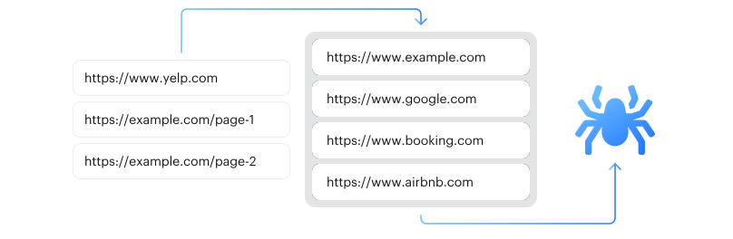
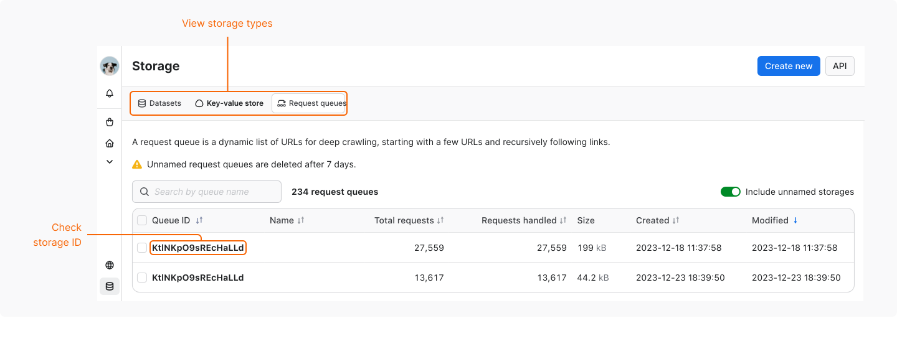

import Tabs from '@theme/Tabs';
import TabItem from '@theme/TabItem';

Request queues store URLs to process, each with an [HTTP method](https://developer.mozilla.org/en-US/docs/Web/HTTP/Methods) and other parameters. They're built for web crawling and for any workload that manages a large list of URLs that grows as it's processed.

A request queue supports breadth-first and depth-first crawling and custom data attributes. It lets you check whether a URL was already encountered, add new URLs, and fetch the next URL to process.

:::info Retention period

Named request queues are retained indefinitely. Unnamed request queues expire after 7 days unless otherwise specified. [Learn more](/storage#data-retention)

:::



## Basic usage

You can access your request queues in several ways:

- [Apify Console](https://console.apify.com) - view and manage your request queues in a visual interface.
- [Apify API](/api/v2) - for accessing your request queues programmatically.
- [Apify API clients](/api) - to access your request queues from any Node.js/Python application.
- [Apify SDKs](/sdk) - when building your own JavaScript/Python Actor.

### Apify Console

In the [Apify Console](https://console.apify.com), you can view your request queues in the [Storage](https://console.apify.com/storage) section under the [Request queues](https://console.apify.com/storage?tab=requestQueues) tab.



To view a request queue, click on its **Queue ID**.
Under the **Actions** menu, you can rename your queue (which affects its [retention period](/storage#named-and-unnamed-storages)) and grant [access rights](/account/collaboration) using the **Share** button.
To view and test a queue's [API endpoints](/api/v2/storage-request-queues), select **API**.

### Apify API

The [Apify API](/api/v2/storage-request-queues) gives you programmatic access to your request queues using [HTTP requests](https://developer.mozilla.org/en-US/docs/Web/HTTP/Methods).

If you are accessing your request queues using the `username~store-name` [store ID format](./index.md), you will need to use your secret API token. You can find the token (and your user ID) on the [API & Integrations](https://console.apify.com/settings/integrations) page of your Apify account.

:::tip Pass tokens in the Authorization header

When providing your API authentication token, we recommend using the request's `Authorization` header, rather than the URL. [More info](../integrations/programming/api.md#authentication).

:::

To get a list of your request queues, send a GET request to the [Get list of request queues](/api/v2/request-queues-get) endpoint.

```text
https://api.apify.com/v2/request-queues
```

To get information about a request queue such as its creation time and item count, send a GET request to the [Get request queue](/api/v2/request-queue-get) endpoint.

```text
https://api.apify.com/v2/request-queues/{QUEUE_ID}
```

To get a request from a queue, send a GET request to the [Get request](/api/v2/request-queue-request-get) endpoint.

```text
https://api.apify.com/v2/request-queues/{QUEUE_ID}/requests/{REQUEST_ID}
```

To add a request to a queue, send a POST request with the request to be added as a JSON object in the request's payload to the [Add request](/api/v2/request-queue-requests-post) endpoint.

```text
https://api.apify.com/v2/request-queues/{QUEUE_ID}/requests
```

Example payload:

```json
{
    "uniqueKey": "http://example.com",
    "url": "http://example.com",
    "method": "GET"
}
```

To update a request in a queue, send a PUT request with the request to update as a JSON object in the request's payload to the [Update request](/api/v2/request-queue-request-put) endpoint. In the payload, specify the request's ID and add the information you want to update.

```text
https://api.apify.com/v2/request-queues/{QUEUE_ID}/requests/{REQUEST_ID}
```

Example payload:

```json
{
    "id": "dnjkDMKLmdlkmlkmld",
    "uniqueKey": "http://example.com",
    "url": "http://example.com",
    "method": "GET"
}
```

:::note `clientKey` parameter

When adding or updating requests, you can optionally provide a `clientKey` parameter to your request. It must be a string between 1 and 32 characters in length. This identifier is used to determine whether the queue was accessed by [multiple clients](./use-from-another-run.md). If `clientKey` is not provided, the system considers this API call to come from a new client. See the `hadMultipleClients` field returned by the [`Get head`](/api/v2/request-queue-head-get) operation for details.

Example: `client-abc`

:::

For further details and a breakdown of each storage API endpoint, refer to the [API documentation](/api/v2/storage-request-queues).

### Apify API Clients

Apify provides API clients for JavaScript and Python applications.

#### JavaScript API client

With the Apify [JavaScript API client](/api/client/js/reference/class/RequestQueueClient) (`apify-client`), you can access your request queues from any Node.js application, whether it's running on the Apify platform or externally.

After importing and initializing the client, you can save each request queue to a variable for easier access.

```js
const myQueueClient = apifyClient.requestQueue('jane-doe/my-request-queue');
```

You can then use that variable to [access the request queue's items and manage it](/api/client/js/reference/class/RequestQueueClient).

Check out the [JavaScript API client documentation](/api/client/js/reference/class/RequestQueueClient) for [help with setup](/api/client/js/docs) and more details.

#### Python API client

With the Apify [Python API client](/api/client/python) (`apify-client`), you can access your request queues from any Python application, whether it's running on the Apify platform or externally.

After importing and initializing the client, you can save each request queue to a variable for easier access.

```python
my_queue_client = apify_client.request_queue('jane-doe/my-request-queue')
```

You can then use that variable to [access the request queue's items and manage it](/api/client/python/reference/class/RequestQueueClient).

Check out the [Python API client documentation](/api/client/python/reference/class/RequestQueueClient) for [help with setup](/api/client/python/docs/overview/introduction) and more details.

### Apify SDKs

Apify provides SDKs for JavaScript and Python Actors.

#### JavaScript SDK

In JavaScript [Actors](../actors/index.mdx), manage request queues with the JavaScript SDK's [`RequestQueue`](/sdk/js/reference/class/RequestQueue) class. It works both locally and on the Apify platform. To add URLs to the queue, use [`addRequests()`](/sdk/js/reference/class/RequestQueue#addRequests).

Every Actor run gets a default request queue, created when the first request is added. The run typically uses it to store the URLs it crawls, but doesn't have to. You can also create named queues and share them between Actors or runs.

If you are storing your data locally, you can find your request queue at the following location.

```text
{APIFY_LOCAL_STORAGE_DIR}/request_queues/{QUEUE_ID}/{ID}.json
```

The default request queue's ID is _default_. Each request in the queue is stored as a separate JSON file, where `{ID}` is a request ID.

To open a request queue, use the [`Actor.openRequestQueue()`](/sdk/js/reference/class/Actor#openRequestQueue) method.

```js
// Import the JavaScript SDK into your project
import { Actor } from 'apify';

await Actor.init();
// ...

// Open the default request queue associated with
// the Actor run
const queue = await Actor.openRequestQueue();

// Open the 'my-queue' request queue
const queueWithName = await Actor.openRequestQueue('my-queue');

// ...
await Actor.exit();
```

Once a queue is open, you can manage it using the following methods. Check out the `RequestQueue` class's [API reference](/sdk/js/reference/class/RequestQueue) for the full list.

```js
// Import the JavaScript SDK into your project
import { Actor } from 'apify';

await Actor.init();
// ...

const queue = await Actor.openRequestQueue();

// Enqueue requests
await queue.addRequests([{ url: 'http://example.com/aaa' }]);
await queue.addRequests(['http://example.com/foo', 'http://example.com/bar'], {
    forefront: true,
});

// Get the next request from queue
const request1 = await queue.fetchNextRequest();
const request2 = await queue.fetchNextRequest();

// Get a specific request
const specificRequest = await queue.getRequest('shi6Nh3bfs3');

// Reclaim a failed request back to the queue
// and process it again
await queue.reclaimRequest(request2);

// Remove a queue
await queue.drop();

// ...
await Actor.exit();
```

Check out the [JavaScript SDK documentation](/sdk/js/docs/guides/request-storage#request-queue) and the `RequestQueue` class's [API reference](/sdk/js/reference/class/RequestQueue) for details on managing your request queues with the JavaScript SDK.

#### Python SDK

In Python [Actors](../actors/index.mdx), manage request queues with the Python SDK's [`RequestQueue`](/sdk/python/reference/class/RequestQueue) class. It works both locally and on the Apify platform. To add URLs to the queue, use [`add_requests()`](/sdk/python/reference/class/RequestQueue#add_requests).

Every Actor run gets a default request queue, created when the first request is added. The run typically uses it to store the URLs it crawls, but doesn't have to. You can also create named queues and share them between Actors or runs.

If you are storing your data locally, you can find your request queue at the following location.

```text
{APIFY_LOCAL_STORAGE_DIR}/request_queues/{QUEUE_ID}/{ID}.json
```

The default request queue's ID is _default_. Each request in the queue is stored as a separate JSON file, where `{ID}` is a request ID.

To _open a request queue_, use the [`Actor.open_request_queue()`](/sdk/python/reference/class/Actor#open_request_queue) method.

```python
from apify import Actor

async def main():
    async with Actor:
        # Open the default request queue associated with the Actor run
        queue = await Actor.open_request_queue()

        # Open the 'my-queue' request queue
        queue_with_name = await Actor.open_request_queue(name='my-queue')

        # ...
```

Once a queue is open, you can manage it using the following methods. See the `RequestQueue` class's [API reference](/sdk/python/reference/class/RequestQueue) for the full list.

```python
from apify import Actor
from apify.storages import RequestQueue

async def main():
    async with Actor:
        queue: RequestQueue = await Actor.open_request_queue()

        # Enqueue requests
        await queue.add_request(request={'url': 'http://example.com/aaa'})
        await queue.add_request(request={'url': 'http://example.com/foo'})
        await queue.add_request(request={'url': 'http://example.com/bar'}, forefront=True)

        # Get the next requests from queue
        request1 = await queue.fetch_next_request()
        request2 = await queue.fetch_next_request()

        # Get a specific request
        specific_request = await queue.get_request('shi6Nh3bfs3')

        # Reclaim a failed request back to the queue and process it again
        await queue.reclaim_request(request2)

        # Remove a queue
        await queue.drop()
```

Check out the [Python SDK documentation](/sdk/python/docs/concepts/storages#working-with-request-queues) and the `RequestQueue` class's [API reference](/sdk/python/reference/class/RequestQueue) for details on managing your request queues with the Python SDK.

## Features

Request queues are built for scraping workloads. The following sections cover the main features; [Crawlee](https://crawlee.dev/), the [Apify SDK for JavaScript](https://docs.apify.com/sdk/js/), and the [Apify SDK for Python](https://docs.apify.com/sdk/python/) support all of them without extra configuration.

### Persistence and retention

Named request queues retain requests indefinitely; unnamed queues follow your subscription's data retention period.
This enables incremental crawling: append new URLs to the queue and resume from where you stopped in subsequent Actor runs.
For example, when scraping an e-commerce website with thousands of products, you can scrape only the products added since the last product discovery.

The following code example uses the Apify SDK and Crawlee to create an incremental crawler that saves the title of each new page found in Apify Docs to a dataset.
By running this Actor multiple times, you can incrementally crawl the source website and save only pages added since the last crawl, as reusing a single request queue ensures that only URLs not yet visited are processed.

```ts
// Basic example of incremental crawling with Crawlee.
import { Actor } from 'apify';
import { CheerioCrawler, Dataset } from 'crawlee';

interface Input {
    startUrls: string[];
    persistRequestQueueName: string;
}

await Actor.init();

// Structure of input is defined in input_schema.json
const {
    startUrls = ['https://docs.apify.com/'],
    persistRequestQueueName = 'persist-request-queue',
} = (await Actor.getInput<Input>()) ?? ({} as Input);

// Open or create request queue for incremental scrape.
// By opening same request queue, the crawler will continue where it left off and skips already visited URLs.
const requestQueue = await Actor.openRequestQueue(persistRequestQueueName);

const proxyConfiguration = await Actor.createProxyConfiguration();

const crawler = new CheerioCrawler({
    proxyConfiguration,
    requestQueue, // Pass incremental request queue to the crawler.
    requestHandler: async ({ enqueueLinks, request, $, log }) => {
        log.info('enqueueing new URLs');
        await enqueueLinks();

        // Extract title from the page.
        const title = $('title').text();
        log.info(`New page with ${title}`, { url: request.loadedUrl });

        // Save the URL and title of the loaded page to the output dataset.
        await Dataset.pushData({ url: request.loadedUrl, title });
    },
});

await crawler.run(startUrls);

await Actor.exit();
```

### Batch operations

Request queues support batch operations on requests to enqueue or retrieve multiple requests in bulk, to cut down on network latency and enable easier parallel processing of requests.
You can find the batch operations in the [Apify API](/api/v2/storage-request-queues), as well in the Apify API client for [JavaScript](https://docs.apify.com/api/client/js/reference/class/RequestQueueClient#batchAddRequests) and [Python](https://docs.apify.com/api/client/python/reference/class/RequestQueueClient#batch_add_requests).

<Tabs groupId="main">
<TabItem value="JavaScript" label="JavaScript">

```js
const { ApifyClient } = require('apify-client');

const client = new ApifyClient({
    token: 'MY-APIFY-TOKEN',
});

const requestQueueClient = client.requestQueue('my-queue-id');

// Add multiple requests to the queue
await requestQueueClient.batchAddRequests([
    {
        url: 'http://example.com/foo',
        uniqueKey: 'http://example.com/foo',
        method: 'GET',
    },
    {
        url: 'http://example.com/bar',
        uniqueKey: 'http://example.com/bar',
        method: 'GET',
    },
]);

// Remove multiple requests from the queue
await requestQueueClient.batchDeleteRequests([
    { uniqueKey: 'http://example.com/foo' },
    { uniqueKey: 'http://example.com/bar' },
]);
```

</TabItem>
<TabItem value="Python" label="Python">

```python
from apify_client import ApifyClient

apify_client = ApifyClient('MY-APIFY-TOKEN')

request_queue_client = apify_client.request_queue('my-queue-id')

# Add multiple requests to the queue
request_queue_client.batch_add_requests([
    {'url': 'http://example.com/foo', 'uniqueKey': 'http://example.com/foo', 'method': 'GET'},
    {'url': 'http://example.com/bar', 'uniqueKey': 'http://example.com/bar', 'method': 'GET'},
])

# Remove multiple requests from the queue
request_queue_client.batch_delete_requests([
    {'uniqueKey': 'http://example.com/foo'},
    {'uniqueKey': 'http://example.com/bar'},
])
```

</TabItem>
</Tabs>

### Distributivity

Request queue includes a locking mechanism to avoid concurrent processing of one request by multiple clients (for example Actor runs).
You can lock a request so that no other clients receive it when they fetch the queue head, with an expiration period on the lock so that requests which fail processing are eventually unlocked and retried.

Crawlee supports request locking with minimal setup. By default, requests are locked for the same duration as the timeout for processing requests in the crawler ([`requestHandlerTimeoutSecs`](https://crawlee.dev/api/next/basic-crawler/interface/BasicCrawlerOptions#requestHandlerTimeoutSecs)).
If the Actor processing the request fails, the lock expires, and the request is processed again eventually. For more details, refer to the [Crawlee documentation](https://crawlee.dev/docs/next/experiments/experiments-request-locking).

In the following example, we demonstrate how you can use locking mechanisms to avoid concurrent processing of the same request across multiple Actor runs.

:::info Lock mechanism
The lock mechanism works on the client level, as well as the run level, when running the Actor on the Apify platform.

This means you can unlock or prolong the lock of a locked request only if:

- You are using the same client key, or
- The operation is being called from the same Actor run.

:::

<Tabs groupId="main">
<TabItem value="Actor 1" label="Actor 1">

```js
import { Actor, ApifyClient } from 'apify';

await Actor.init();

const client = new ApifyClient({
    token: 'MY-APIFY-TOKEN',
});

// Creates a new request queue.
const requestQueue = await client.requestQueues().getOrCreate('example-queue');

// Creates two clients with different keys for the same request queue.
const requestQueueClient = client.requestQueue(requestQueue.id, {
    clientKey: 'requestqueueone',
});

// Adds multiple requests to the queue.
await requestQueueClient.batchAddRequests([
    {
        url: 'http://example.com/foo',
        uniqueKey: 'http://example.com/foo',
        method: 'GET',
    },
    {
        url: 'http://example.com/bar',
        uniqueKey: 'http://example.com/bar',
        method: 'GET',
    },
    {
        url: 'http://example.com/baz',
        uniqueKey: 'http://example.com/baz',
        method: 'GET',
    },
    {
        url: 'http://example.com/qux',
        uniqueKey: 'http://example.com/qux',
        method: 'GET',
    },
]);

// Locks the first two requests at the head of the queue.
const processingRequestsClientOne = await requestQueueClient.listAndLockHead(
    {
        limit: 2,
        lockSecs: 120,
    },
);

// Checks when the lock will expire. The locked request will have a lockExpiresAt attribute.
const lockedRequest = processingRequestsClientOne.items[0];
const lockedRequestDetail = await requestQueueClient.getRequest(
    lockedRequest.id,
);
console.log(`Request locked until ${lockedRequestDetail?.lockExpiresAt}`);

// Prolongs the lock of the first request or unlocks it.
await requestQueueClient.prolongRequestLock(
    lockedRequest.id,
    { lockSecs: 120 },
);
await requestQueueClient.deleteRequestLock(
    lockedRequest.id,
);

await Actor.exit();
```

</TabItem>
<TabItem value="Actor 2" label="Actor 2">

```js
import { Actor, ApifyClient } from 'apify';

await Actor.init();

const client = new ApifyClient({
    token: 'MY-APIFY-TOKEN',
});

// Waits for the first Actor to lock the requests.
await new Promise((resolve) => setTimeout(resolve, 5000));

// Get the same request queue in different Actor run and with a different client key.
const requestQueue = await client.requestQueues().getOrCreate('example-queue');

const requestQueueClient = client.requestQueue(requestQueue.id, {
    clientKey: 'requestqueuetwo',
});

// Get all requests from the queue and check one locked by the first Actor.
const requests = await requestQueueClient.listRequests();
const requestsLockedByAnotherRun = requests.items.filter((request) => request.lockByClient === 'requestqueueone');
const requestLockedByAnotherRunDetail = await requestQueueClient.getRequest(
    requestsLockedByAnotherRun[0].id,
);

// Other clients cannot list and lock these requests; the listAndLockHead call returns other requests from the queue.
const processingRequestsClientTwo = await requestQueueClient.listAndLockHead(
    {
        limit: 10,
        lockSecs: 60,
    },
);
const wasBothRunsLockedSameRequest = !!processingRequestsClientTwo.items.find(
    (request) => request.id === requestLockedByAnotherRunDetail.id,
);

console.log(`Was the request locked by the first run locked by the second run? ${wasBothRunsLockedSameRequest}`);
console.log(`Request locked until ${requestLockedByAnotherRunDetail?.lockExpiresAt}`);

// Other clients cannot modify the lock; attempting to do so will throw an error.
try {
    await requestQueueClient.prolongRequestLock(
        requestLockedByAnotherRunDetail.id,
        { lockSecs: 60 },
    );
} catch (err) {
    // This will throw an error.
}

// Cleans up the queue.
await requestQueueClient.delete();

await Actor.exit();
```

</TabItem>
</Tabs>

A detailed tutorial on how to process one request queue with multiple Actor runs can be found in [Academy tutorials](https://docs.apify.com/academy/node-js/multiple-runs-scrape).

## Share and reuse {#share}

You can grant access rights to your request queue or share it by link. See [Share storage](./share.md).

To add requests to a queue that belongs to a different Actor or task run, see [Use storage from another run](./use-from-another-run.md).

## Limits

- The maximum length for request queue name is 63 characters.

### Rate limiting

When managing request queues via [API](/api/v2/storage-request-queues-requests),
CRUD ([add](/api/v2/request-queue-requests-post),
[get](/api/v2/request-queue-request-get),
[update](/api/v2/request-queue-request-put),
[delete](/api/v2/request-queue-request-delete))
operation requests are limited to _350 requests per second_ per request queue. This helps protect Apify servers from being overloaded.

Request-lock operations ([prolong a lock](/api/v2/request-queue-request-lock-put) and [delete a lock](/api/v2/request-queue-request-lock-delete)) are also limited to _350 requests per second_ per request queue.

Batch operations ([add](/api/v2/request-queue-requests-batch-post) and [delete](/api/v2/request-queue-requests-batch-delete)) and the [list and lock head](/api/v2/request-queue-head-lock-post) endpoint are limited to _35 requests per second_ per request queue.

All other request queue API [endpoints](/api/v2/storage-request-queues) are limited to _60 requests per second_ per request queue.

Check out the [API documentation](/api/v2#rate-limiting) for more information and guidance on actions to take if you exceed these rate limits.
