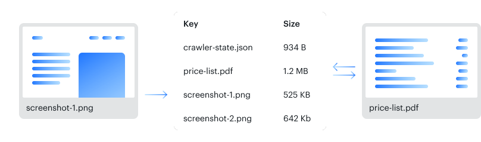

**Learn how to effectively use Apify's storage options. Understand key aspects of data retention, rate limiting, and secure sharing.**

---

## Dataset {#dataset}

[Dataset](./dataset.md) storage allows you to store a series of data objects, such as results from web scraping, crawling, or data processing jobs. You can export your datasets in JSON, CSV, XML, RSS, Excel, or HTML formats.


## Key-value store {#key-value-store}

The [key-value store](./key_value_store.md) is ideal for saving data records such as files, screenshots of web pages, and PDFs or for persisting your Actor's state. The records are accessible under a unique name and can be written and read quickly.




## Request queue {#request-queue}

[Request queues](./request_queue.md) allow you to dynamically maintain a queue of URLs of web pages. You can use this when recursively crawling websites: you start from initial URLs and add new links as they are found while skipping duplicates.


## Basic usage {#basic-usage}

There are several ways to access your storage:

* [Apify Console](https://console.apify.com/storage) - provides an easy-to-use interface.
* [Apify SDK](/sdk) - when building your own JavaScript/Python Actor.
* [API clients](/api) - to access your storages from any Node.js/Python application.
* [Apify API](/api/v2#/reference/key-value-stores) - to access your storages programmatically.

### Apify Console {#apify-console}

To access your storages via Apify Console, navigate to the [**Storage**](https://console.apify.com/storage) section in the left-side menu. From there, you can click through the tabs to view your key-value stores, datasets, and request queues, and you can click on the **API** button in the top right corner to view related API endpoints. To view a storage, click its **ID**.


> Use the **Include unnamed storages** checkbox to either display or hide unnamed storages. By default Apify Console will display them.

You can edit your store's name by clicking on the **Actions** menu and selecting **Rename**.

Additionally, you can quickly share the contents and details of your storage by selecting **Share** under the **Actions** menu and providing either email, username or user ID.


These URLs link to API _endpoints_—the places where your data is stored. Endpoints that allow you to _read_ stored information do not require an [authentication token](/api/v2#/introduction/authentication). Calls are authenticated using a hard-to-guess ID, allowing for secure sharing. However, operations such as _update_ or _delete_ require the authentication token.

> Never share a URL containing your authentication token, to avoid compromising your account's security. <br/>
> If the data you want to share requires a token, first download the data, then share it as a file.

### Apify SDKs

The Apify SDKs are libraries in JavaScript or Python that proviede tools for building your own Actors.</br>

* JavaScript SDK requires [Node.js](https://nodejs.org/en/) 16 or later.
* Python SDK requires [Python](https://www.python.org/downloads/release/python-380/) 3.8 or above.

### Apify API Clients

The Apify API Clients allow you to access your datasets from any Node.js or Python application, whether it's running on the Apify platform or externally.

You can visit [API Clients](/api) documentations for more information.

### Apify API {#apify-api}

The [Apify API](/api/v2#/reference/key-value-stores) allows you to access your storages programmatically using [HTTP requests](https://developer.mozilla.org/en-US/docs/Web/HTTP/Methods) and easily share your crawling results.

In most cases, when accessing your storages via API, you will need to provide a `store ID`, which you can do in the following formats:

* `WkzbQMuFYuamGv3YF` - the store's alphanumerical ID if the store is unnamed.
* `~store-name` - the store's name prefixed with tilde (`~`) character if the store is named (e.g. `~ecommerce-scraping-results`)
* `username~store-name` - username and the store's name separated by a tilde (`~`) character if the store is named and belongs to a different account (e.g. `janedoe~ecommerce-scraping-results`). Note that in this case, the store's owner needs to grant you access first.

For read (GET) requests, it is enough to use a store's alphanumerical ID, since the ID is hard to guess and effectively serves as an authentication key.

With other request types and when using the `username~store-name`, however, you will need to provide your secret API token in your request's [`Authorization`](/api/v2#/introduction/authentication) header or as a query parameter. You can find your token on the [Integrations](https://console.apify.com/account?tab=integrations) page of your Apify account.

For further details and a breakdown of each storage API endpoint, refer to the [API documentation](/api/v2#/reference/datasets).

## Rate limiting {#rate-limiting}

All API endpoints limit their rate of requests to protect Apify servers from overloading. The default rate limit for storage objects is _30 requests per second_. However, there are exceptions limited to _200 requests per second_ per storage object, including:

* [Push items](/api/v2#/reference/datasets/item-collection/put-items) to dataset.
* CRUD ([add](/api/v2#/reference/request-queues/request-collection/add-request),
[get](/api/v2#/reference/request-queues/request-collection/get-request),
[update](/api/v2#/reference/request-queues/request-collection/update-request),
[delete](/api/v2#/reference/request-queues/request-collection/delete-request))
operations of _request queue_ requests.

If a client exceeds this limit, the API endpoints responds with the HTTP status code `429 Too Many Requests` and the following body:

```json
{
    "error": {
        "type": "rate-limit-exceeded",
        "message": "You have exceeded the rate limit of ... requests per second"
    }
}
```

Go to the [API documentation](/api/v2#/introduction/rate-limiting) for details and to learn what to do if you exceed the rate limit.

## Data retention {#data-retention}

Named datasets are retained indefinitely.
Unnamed datasets expire after 7 days unless otherwise specified.

### Preserving your storages {#preserving-storages}

To ensure indefinite retention of your storages, assign them a name. This can be done via Apify Console or through our API. First, you'll need your store's ID. You can find it in the details of the run that created it. In Apify Console, head over to your run's details and select the **Dataset**, **Key-value store**, or **Request queue** tab as appropriate. Check that store's details, and you will find its ID among them.


Find and open your storage by clicking the ID, click on the **Actions** menu, choose **Rename**, and enter its new name in the field. Your storage will now be preserved indefinitely.

To name your storage via API, get its ID from the run that generated it using the [Get run](/api/v2#/reference/actor-runs/run-object-and-its-storages/get-run) endpoint. You can then give it a new name using the `Update \[storage\]` endpoint. For example, [Update dataset](/api/v2#/reference/datasets/dataset/update-dataset).

Our SDKs and clients each have unique naming conventions for storages. For more information check out documentation:

* [SDKs](/sdk)
* [API Clients](/api)

## Named and unnamed storages {#named-and-unnamed-storages}

The default storages for an Actor run are unnamed, identified only by an _ID_. This allows them to expire after 7 days (or longer on paid plans) conserving your storage space. If you want to preserve a storage, [assign it a name](#preserving-storages), and it will be retained indefinitely.

> Storages' names can be up to 63 characters long.

Named and unnamed storages are identical in all aspects except for their retention period. The key advantage of named storages is their ease in identifying and verifying the correct store.

For example, storage names `janedoe~my-storage-1` and `janedoe~web-scrape-results` are easier to tell apart than the alphanumerical IDs `cAbcYOfuXemTPwnIB` and `CAbcsuZbp7JHzkw1B`.

## Sharing {#sharing}

You can grant [access rights](../collaboration/index.md) to others Apify users to view or modify your storages. Check the [full list of permissions](../collaboration/list_of_permissions.md).

### Sharing storages between runs {#sharing-storages-between-runs}

Storage can be accessed from any [Actor](../actors/index.mdx) or [task](../actors/running/tasks.md) run, provided you have its _name_ or _ID_. You can access and manage storages from other runs using the same methods or endpoints as with storages from your current run.

[Datasets](./dataset.md) and [key-value stores](./key_value_store.md) support concurrent use by multiple Actors. Thus, several Actors or tasks can simultaneously write data to a single dataset or key-value store. Similarly, multiple runs can read data from datasets and key-value stores at the same time.

[Request queues](./request_queue.md), on the other hand, only allow multiple runs to add new data. A request queue can only be processed by one Actor or task run at any one time.

> When multiple runs try to write data to a storage simultaneously, the order of data writing cannot be controlled. Data is written as each request is processed. <br/>
> Similar principle applies in key-value stores and request queues, when a delete request for a record precedes a read request for the same record, the read request will fail.

## Deleting storages {#deleting-storages}

Named storages are only removed upon your request.<br/>
You can delete storages in the following ways:

* [Apify Console](https://console.apify.com/storage) - using the **Actions** button in the store's detail page.
* [JavaScript SDK](/sdk/js) - using the `.drop()` method of the
  [Dataset](/sdk/js/api/apify/class/Dataset#drop),
  [Key-value store](/sdk/js/api/apify/class/KeyValueStore#drop),
  or [Request queue](/sdk/js/api/apify/class/RequestQueue#drop) class.
* [Python SDK](/sdk/python) - using the `.drop()` method of the
  [Dataset](/sdk/python/reference/class/Dataset#drop),
  [Key-value store](/sdk/python/reference/class/KeyValueStore#drop),
  or [Request queue](/sdk/python/reference/class/RequestQueue#drop) class.
* [JavaScript API client](/api/client/js) - using the `.delete()` method in the
[dataset](/api/client/js/reference/class/DatasetClient),
[key-value store](/api/client/js/reference/class/KeyValueStoreClient),
or [request queue](/api/client/js/reference/class/RequestQueueClient) clients.
* [Python API client](/api/client/python) - using the `.delete()` method in the
[dataset](/api/client/python#datasetclient),
[key-value store](/api/client/python/reference/class/KeyValueStoreClient),
or [request queue](/api/client/python/reference/class/RequestQueueClient) clients.
* [API](/api/v2#/reference/key-value-stores/store-object/delete-store) using the - `Delete [store]` endpoint, where `[store]` is the type of storage you want to delete.
