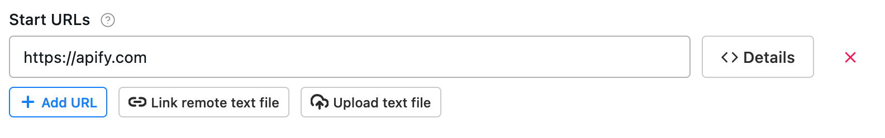
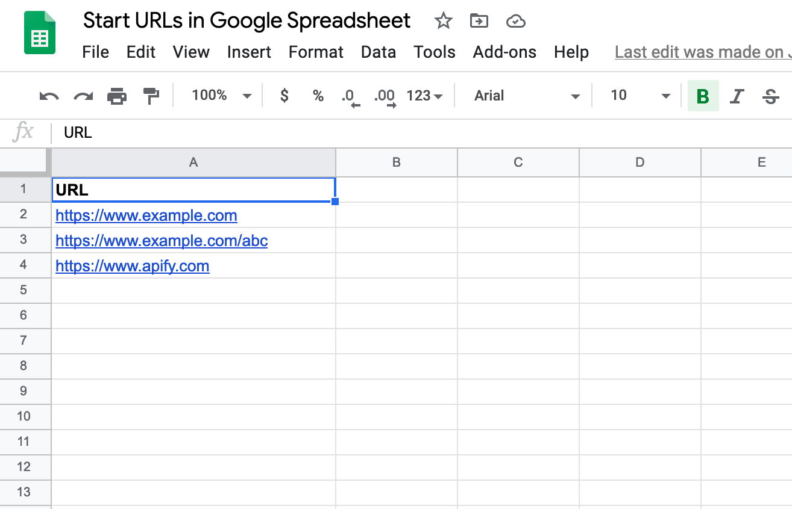
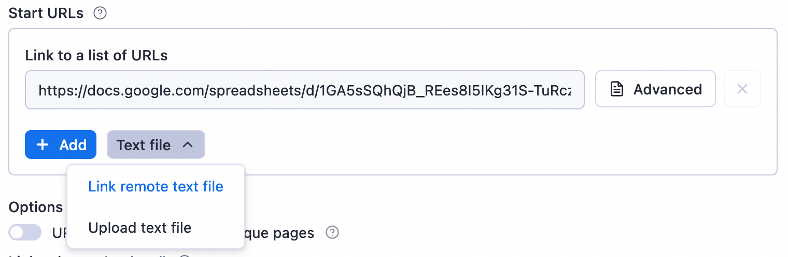
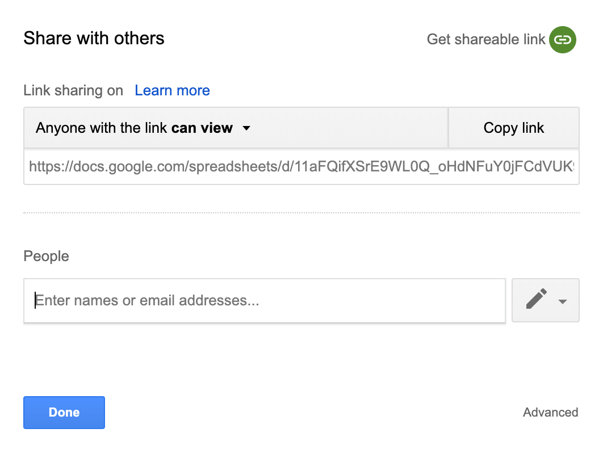

# Crawl a list of URLs from a Google Sheets document

**Learn to crawl and scrape data from URLs specified in a spreadsheet with Apify scrapers. Scrape a pre-determined list of web pages with Apify actors.**

---

[Actors](../actors/index.md) such as **Web Scraper** ([apify/web-scraper](https://apify.com/apify/web-scraper)) **Cheerio Scraper** ([apify/cheerio-scraper](https://apify.com/apify/web-scraper)) and **Puppeteer Scraper** ([apify/puppeteer-scraper](https://apify.com/apify/web-scraper)) make it simple to crawl web pages and extract data from them.

These actors start with a pre-defined list of URLs ([start URLs](./apify_scrapers/getting_started.md)), then recursively follow links to find new pages (optional).

Let's say you have the start URLs you want to crawl stored in a [Google Sheets](https://www.google.com/sheets/about/) spreadsheet, such as [this one](
https://docs.google.com/spreadsheets/d/1GA5sSQhQjB_REes8I5IKg31S-TuRcznWOPjcpNqtxmU).

You don't have to add them to the actor manually or export them as a file, only to upload to the scraper. Just click the **Text file** -> **Link remote text file** button in the actor's input and paste the URL.

**IMPORTANT: Make sure the document can be viewed by anyone with the link, otherwise the actor will not be able to access it.**

And that's it, now the actor will download the content of the spreadsheet with up-to-date URLs whenever it starts.

> Beware that the spreadsheet should have a simple structure, so the actor can easily find the URLs in it. Also, it should only have one sheet.
