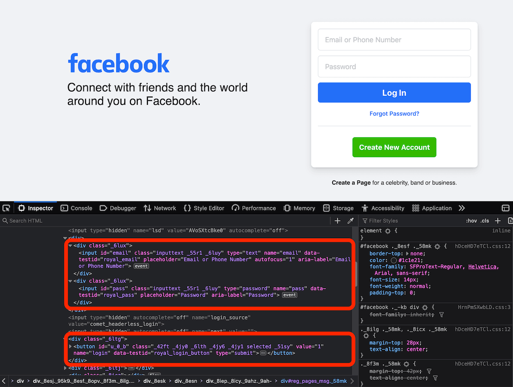

# Log into a website using Puppeteer

**Learn how to complete a website's authentication process using headless Chrome and Puppeteer. Automate the filling in of log in details and passwords.**

---

In this article, we demonstrate how you can easily scrape data from a page behind a login using an [Apify actor](../actors/index.md) with [Puppeteer](https://pptr.dev/). For this example, we will use [https://facebook.com](https://www.facebook.com/).

## Find the login form {#find-the-login-form}

First, let's find the **login form** and the **submit** button on the Facebook login page using Chrome's DevTools. Right-click on any of the elements in the form and choose **Inspect**.



We can see an HTML **input** element with the IDs `email` for email and `pass` for the password. The form submission button's ID is not very helpful, however we can see it is a **button** element with the name `login` and type `submit`. We will use its ID, which is `u_0_b`.

## Code the actor to fill in details {#code-the-actor-to-fill-in-details}

Our actor will use the Puppeteer API to fill in the **username** and **password** and click the **submit** button.

```js
import { Actor } from 'apify';
import { launchPuppeteer, log } from 'crawlee';

await Actor.init();

// Get the username and password inputs
const input = await Actor.getInput();

const browser = await launchPuppeteer();
const page = await browser.newPage();
await page.goto('https://facebook.com');

// Login
await page.type('#email', input.username);
await page.type('#pass', input.password);
await page.click('#u_0_b');
await page.waitForNavigation();

// Get cookies
const cookies = await page.cookies();

// Use cookies in another tab or browser
const page2 = await browser.newPage();
await page2.setCookie(...cookies);
// Open the page as a logged-in user
await page2.goto('https://facebook.com');

await browser.close();

log.info('Done.');

await Actor.exit();
```

Now, you can run the actor and pass the login credentials as an [input JSON object](https://docs.apify.com/sdk/js/docs/examples/accept-user-input#docsNav).

```json
{
    "username": "marge@example.com",
    "password": "my secret password"
}
```

## Save and reuse cookies {#save-and-reuse-cookies}

For most pages, you need to save cookies and reuse then in following runs. You can avoid logging in for each run with the code below.

The example below uses a [named key-value store](../storage/index.md) to save cookies for upcoming runs.

```js
import { Actor } from 'apify';
import { launchPuppeteer, log } from 'crawlee';

await Actor.init();

const loggedCheck = async (page) => {
    try {
        await page.waitForSelector('#bluebarRoot', { timeout: 10000 });
        return true;
    } catch(err) {
        return false;
    }
};

// Get the username and password inputs
const input = await Actor.getInput();

const fcbCacheStore = await Actor.openKeyValueStore('fcb-cache');
const cookiesStoreKey = input.username.replace('@', '(at)');

const browser = await launchPuppeteer();
const page = await browser.newPage();

let isLogged = false;
let userCookies = await fcbCacheStore.getValue(cookiesStoreKey);
if (userCookies) {
    log.info('Trying to use cached cookies...')
    await page.setCookie(...userCookies);
    await page.goto('https://facebook.com');
    isLogged = await loggedCheck(page);
}

if (!isLogged) {
    log.info(`Cookies from the cache didn't work. Try to log in.`);
    await page.goto('https://facebook.com');
    await page.type('#email', input.username);
    await page.type('#pass', input.password);
    await page.click('#u_0_b');
    await page.waitForNavigation();
    isLogged = await loggedCheck(page);
}

if (!isLogged) {
    throw new Error('Incorrect username or password.')
}

// Get cookies and refresh them in store cache
log.info(`Saving new cookies to cache...`);
const cookies = await page.cookies();
await fcbCacheStore.setValue(cookiesStoreKey, cookies);

// Use cookies in another tab or browser
const page2 = await browser.newPage();
await page2.setCookie(...cookies);
// Opens thepage as a logged-in user
await page2.goto('https://facebook.com');

await browser.close();

log.info('Done.');

await Actor.exit();
```
