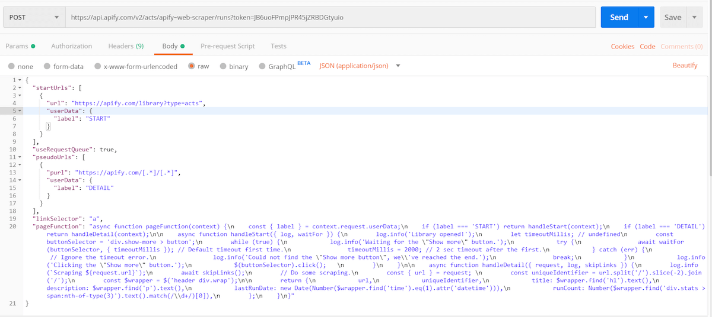
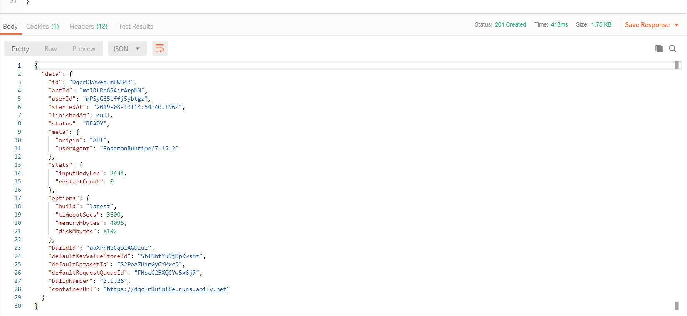
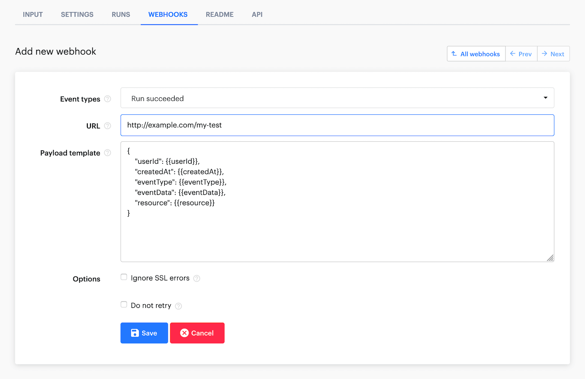

# Run an actor or task and retrieve data via API

**Learn how to run an actor/task via the Apify API, wait for the job to finish, and retrieve its output data. Your key to integrating actors with your projects.**

---

The most popular way of [integrating](https://help.apify.com/en/collections/1669767-integrating-with-apify) the Apify platform with an external project/application is by programmatically running an [actor](../actors/index.md) or [task](../actors/running/tasks.md), waiting for it to complete its run, then collecting its data and using it within the project. Though this process sounds somewhat complicated, it's actually quite easy to do; however, due to the plethora of features offered on the Apify platform, new users may not be sure how exactly to implement this type of integration. So, let's dive in and see how you can do it.

> Remember to check out our [API documentation](/api/v2) with examples in different languages and a live API console. We also recommend testing the API with a nice desktop client like [Postman](https://www.getpostman.com/) or [Insomnia](https://insomnia.rest).

There are 2 main ways of using the Apify API:

- [Synchronously](#synchronous-flow)
- [Asynchronously](#asynchronous-flow)

If the actor being run via API takes 5 minutes or less to complete a typical run, it should be called **synchronously**. Otherwise, (if a typical run takes longer than 5 minutes), it should be called **asynchronously**.

## Run an actor or task {#run-an-actor-or-task}

> If you are unsure about the differences between an actor and task, you can read about them in the [tasks](../actors/running/tasks.md) documentation. In brief, tasks are just pre-configured inputs for actors.

The API endpoints and usage (for both sync and async) for [actors](/api/v2#/reference/actors/run-collection/run-actor) and [tasks](/api/v2#/reference/actor-tasks/run-collection/run-task) are essentially the same.

To run, or **call**, an actor/task, you will need a few things:

- The name or ID of the actor/task. The name looks like `username~actorName` or `username~taskName`. The ID can be retrieved on the **Settings** page of the actor/task.

- Your [API token](../integrations/index.md), which you can find on the **Integrations** page in the [Apify Console](https://console.apify.com/account?tab=integrations) (make sure it does not get leaked anywhere!).

- Possibly an input, which is passed in JSON format as the request's **body**.

- Some other optional settings if you'd like to change the default values (such as allocated memory or the build).

The URL for a [POST request](https://developer.mozilla.org/en-US/docs/Web/HTTP/Methods/POST) to run an actor looks like this:

```cURL
https://api.apify.com/v2/acts/ACTOR_NAME_OR_ID/runs?token=YOUR_TOKEN
```

For tasks, we can just switch the path from **acts** to **actor-tasks** and keep the rest the same:

```cURL
https://api.apify.com/v2/actor-tasks/TASK_NAME_OR_ID/runs?token=YOUR_TOKEN
```

If we send a correct POST request to one of these endpoints, the actor/actor-task will start just as if we had pressed the **Start** button on the actor's page in the [Apify Console](https://console.apify.com).

### Additional settings {#additional-settings}

We can also add settings for the actor (which will override the default settings) as additional query parameters. For example, if we wanted to change how much memory the actor's run should be allocated and which build to run, we could simply add the `memory` and `build` parameters separated by `&`.

```cURL
https://api.apify.com/v2/acts/ACTOR_NAME_OR_ID/runs?token=YOUR_TOKEN&memory=8192&build=beta
```

This works nearly identically for both actors and tasks; however, for tasks there is no reason to specify a [`build`](../actors/development/builds.md) parameter, as a task already has only one specific actor build which cannot be changed with query parameters.

### Input JSON {#input-json}

Most actors would not be much use if input could not be passed into them to change their behavior. Additionally, even though tasks already have specified input configurations, it is handy to have the ability to overwrite task inputs through the **body** of the POST request.

> The input can technically be any [JSON object](https://developer.mozilla.org/en-US/docs/Web/JavaScript/Reference/Global_Objects/JSON), and will vary depending on the actor being run. Ensure that you are familiar with the actor's input schema while writing the body of the request.

Good actors have reasonable defaults for most input fields, so if you want to run one of the major actors from [Apify Store](https://apify.com/store), you usually do not need to provide all possible fields.

Via API, let's quickly try to run [Web Scraper](https://apify.com/apify/web-scraper), which is the most popular actor on the Apify Store at the moment. The full input with all possible fields is [pretty long and ugly](https://apify.com/apify/web-scraper?section=example-run), so we will not show it here. Because it has default values for most fields, we can provide a simple JSON input containing only the fields we'd like to customize. We will send a POST request to the endpoint below and add the JSON as the **body** of the request:

```cURL
https://api.apify.com/v2/acts/apify~web-scraper/runs?token=YOUR_TOKEN
```

Here is how it looks in [Postman](https://www.getpostman.com/):



If we press **Send**, it will immediately return some info about the run. The `status` will be either `READY` (which means that it is waiting to be allocated on a server) or `RUNNING` (99% of cases).



We will later use this **run info** JSON to retrieve the run's output data. This info about the run can also be retrieved with another call to the [**Get run**](https://apify.com/docs/api/v2#/reference/actors/run-object/get-run) endpoint.

## Synchronous flow {#synchronous-flow}

If each of your runs will last shorter than 5 minutes, you can use a single [synchronous endpoint](https://usergrid.apache.org/docs/introduction/async-vs-sync.html#synchronous). When running **synchronously**, the connection will be held for _up to_ 5 minutes.

If your synchronous run exceeds the 5-minute time limit, the response will be a run object containing information about the run and the status of `RUNNING`. If that happens, you need to restart the run [asynchronously](#asynchronous-flow) and [wait for the run to finish](#wait-for-the-run-to-finish).

### Synchronous runs with dataset output {#synchronous-runs-with-dataset-output}

Most actor runs will store their data in the default [dataset](../storage/dataset.md). The Apify API provides **run-sync-get-dataset-items** endpoints for [actors](/api/v2#/reference/actors/run-actor-synchronously-and-get-dataset-items/run-actor-synchronously-with-input-and-get-dataset-items) and [tasks](/api/v2#/reference/actor-tasks/run-task-synchronously-and-get-dataset-items/run-task-synchronously-and-get-dataset-items-(post)), which allow you to run an actor and receive the items from the default dataset once the run has completed.

Here is a simple Node.js example of calling a task via the API and logging the dataset items to the console:

```js
// Use your favorite HTTP client
import got from 'got';

// Specify your API token
// (find it at https://console.apify.com/account#/integrations)
const myToken = <YOUR_APIFY_TOKEN>;

// Start apify/google-search-scraper actor
// and pass some queries into the JSON body
const response = await got({
    url: `https://api.apify.com/v2/acts/apify~google-search-scraper/run-sync-get-dataset-items?token=${myToken}`,
    method: 'POST',
    json: {
        queries: 'web scraping\nweb crawling'
    },
    responseType: 'json',
});

const items = response.body;

// Log each non-promoted search result for both queries
items.forEach((item) => {
    const { nonPromotedSearchResults } = item;
    nonPromotedSearchResults.forEach((result) => {
        const { title, url, description } = result;
        console.log(`${title}: ${url} --- ${description}`);
    });
});
```

### Synchronous runs with key-value store output {#synchronous-runs-with-key-value-store-output}

[Key-value stores](../storage/key_value_store.md) are useful for storing files like images, HTML snapshots, or JSON data. The Apify API provides **run-sync** endpoints for [actors](/api/v2#/reference/actors/run-actor-synchronously/with-input) and [tasks](/api/v2#/reference/actor-tasks/run-task-synchronously/run-task-synchronously), which allow you to run a specific task and receive the output. By default, they return the `OUTPUT` record from the default key-value store.

> For more detailed information, check the [API reference](/api/v2#/reference/actors/run-actor-synchronously-and-get-dataset-items/run-actor-synchronously-with-input-and-get-dataset-items).

## Asynchronous flow {#asynchronous-flow}

For runs longer than 5 minutes, the process consists of three steps:

- [Run the actor or task](#run-an-actor-or-task)
- [Wait for the run to finish](#wait-for-the-run-to-finish)
- [Collect the data](#collect-the-data)

### Wait for the run to finish {#wait-for-the-run-to-finish}

There may be cases where we need to simply run the actor and go away. But in any kind of integration, we are usually interested in its output. We have three basic options for how to wait for the actor/task to finish.

- [`waitForFinish` parameter](#waitforfinish-parameter)
- [Webhooks](#webhooks)
- [Polling](#polling)

#### `waitForFinish` parameter {#waitforfinish-parameter}

This solution is quite similar to the synchronous flow. To make the POST request wait, add the `waitForFinish` parameter. It can have a value from `0` to `300`, which is the maximum time in seconds to wait (the max value for `waitForFinish` is 5 minutes). Knowing this, we can extend the example URL like this:

```cURL
https://api.apify.com/v2/acts/apify~web-scraper/runs?token=YOUR_TOKEN&waitForFinish=300
```

You can also use the `waitForFinish` parameter with the [**GET Run** endpoint](/api/v2#/reference/actors/run-object/get-run) to implement a smarter [polling](#polling) system.

Once again, the final response will be the **run info object**; however, now its status should be `SUCCEEDED` or `FAILED`. If the run exceeds the `waitForFinish` duration, the status will still be `RUNNING`.

#### Webhooks {#webhooks}

If you have a server, [webhooks](../integrations/webhooks/index.md) are the most elegant and flexible solution for integrations with Apify. You can simply set up a webhook for any actor or task, and that webhook will send a POST request to your server after an [event](../integrations/webhooks/events.md) has occurred.

Usually, this event is a successfully finished run, but you can also set a different webhook for failed runs, etc.



The webhook will send you a pretty complicated [JSON object](../integrations/webhooks/actions.md), but usually you are only interested in the `resource` object within the response, which is essentially just the **run info** JSON from the previous sections. We can leave the payload template as is as for our example use case, since it is what we need.

Once your server receives this request from the webhook, you know that the event happened, and you can ask for the complete data.

> Don't forget to respond to the webhook with a **200** status code! Otherwise, it will ping you again.

#### Polling {#polling}

What if you don't have a server, and the run you'd like to do is much too long to use a synchronous call? In cases like these, periodic **polling** of the run's status is the solution.

When we run the actor with the [usual API call](#run-an-actor-or-task) shown above, we will be responded back with the **run info** object. From this JSON object, we can then extract the ID of the actor run that we just started from the `id` field. Then, we can set an interval that will poll the Apify API (let's say every 5 seconds) by calling the [**Get run**](https://apify.com/docs/api/v2#/reference/actors/run-object/get-run) endpoint to retrieve the run's status.

Simply replace the `RUN_ID` in the following URL with the ID you extracted earlier:

```cURL
https://api.apify.com/v2/acts/ACTOR_NAME_OR_ID/runs/RUN_ID
```

Once a status of `SUCCEEDED` or `FAILED` has been received, we know the run has finished and can cancel the interval and finally [collect the data](#collect-the-data).

### Collecting the data {#collect-the-data}

Unless you used the [synchronous call](#synchronous-flow) mentioned above, you will have to make one additional request to the API to retrieve the data.

The **run info** JSON also contains the IDs of the default [dataset](../storage/dataset.md) and [key-value store](../storage/key_value_store.md) that are allocated separately for each run, which is usually everything you need. The fields are called `defaultDatasetId` and `defaultKeyValueStoreId`.

#### Retrieving a dataset {#retrieve-a-dataset}

> If you are scraping products, or any list of items with similar fields, the [dataset](/platform/storage/dataset) should be your storage of choice. Don't forget though, that dataset items are immutable. This means that you can only add to the dataset, and not change the content that is already inside it.

Retrieving the data from a dataset is simple. Just send a GET request to the [**Get items**](/api/v2#/reference/datasets/item-collection/get-items) endpoint and pass the `defaultDatasetId` into the URL. For a GET request to the default dataset, no token is needed.

```cURL
https://api.apify.com/v2/datasets/DATASET_ID/items
```

By default, it will return the data in JSON format with some metadata. The actual data are in the `items` array.

There are plenty of additional parameters that you can use. You can learn about them in the [documentation](/api/v2#/reference/datasets/item-collection/get-items). We will only mention that you can pass a `format` parameter that transforms the response into popular formats like CSV, XML, Excel, RSS, etc.

The items are paginated, which means you can ask only for a subset of the data. Specify this using the `limit` and `offset` parameters. There is actually an overall limit of 250,000 items that the endpoint can return per request. To retrieve more, you will need to send more requests incrementing the `offset` parameter.

```cURL
https://api.apify.com/v2/datasets/DATASET_ID/items?format=csv&offset=250000
```

#### Retrieving a key-value store {#retrieve-a-key-value-store}

> [Key-value stores](../storage/key_value_store.md) are mainly useful if you have a single output or any kind of files that cannot be [stringified](https://developer.mozilla.org/en-US/docs/Web/JavaScript/Reference/Global_Objects/JSON/stringify) (such as images or PDFs).

When you want to retrieve something from a key-value store, the `defaultKeyValueStoreId` is _not_ enough. You also need to know the name (or **key**) of the record you want to retrieve.

If you have a single output JSON, the convention is to return it as a record named `OUTPUT` to the default key-value store. To retrieve the record's content, call the [**Get record**](/api/v2#/reference/key-value-stores/record/get-record) endpoint.

```cURL
https://api.apify.com/v2/key-value-stores/STORE_ID/records/RECORD_KEY
```

If you don't know the keys (names) of the records in advance, you can retrieve just the keys with the [**List keys**](https://apify.com/docs/api/v2#/reference/key-value-stores/key-collection/get-list-of-keys) endpoint.

Keep in mind that you can get a maximum of 1000 keys per request, so you will need to paginate over the keys using the `exclusiveStartKey` parameter if you have more than 1000 keys. To do this, after each call, take the last record key and provide it as the `exclusiveStartKey` parameter. You can do this until you get 0 keys back.

```cURL
https://api.apify.com/v2/key-value-stores/STORE_ID/keys?exclusiveStartKey=myLastRecordKey
```
